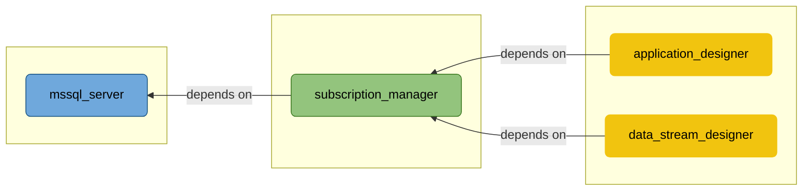
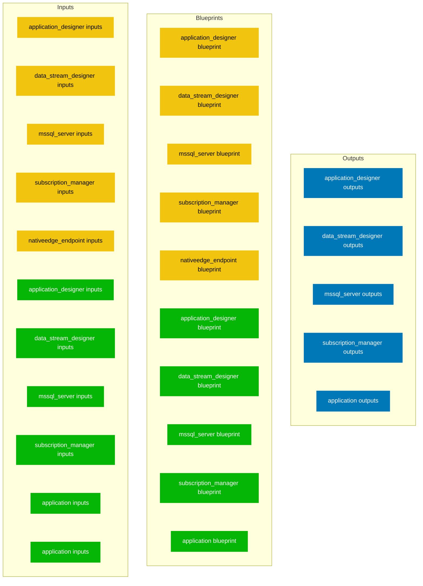

This document is auto-generated from the YAML file <SwmPath>[XMPro_Suite_for_NativeEdge_Endpoint.yaml](/XMPro_Suite_for_NativeEdge_Endpoint.yaml)</SwmPath>

The <SwmToken path="/XMPro_Suite_for_NativeEdge_Endpoint.yaml" pos="1:0:0" line-data="tosca_definitions_version: dell_1_0">`tosca_definitions_version`</SwmToken> is <SwmToken path="/XMPro_Suite_for_NativeEdge_Endpoint.yaml" pos="1:3:3" line-data="tosca_definitions_version: dell_1_0">`dell_1_0`</SwmToken>.

# 1 Solution Architecture

## 1.1 Overview

- Creates Windows Virtual Machines on NativeEdge Endpoint and installs XMPro Software.

## 1.2 Architecture Diagram

# 2 Blueprint Structure

## 2.1 Blueprint Diagram

## 2.2 Blueprint Directory Structure

- ./
- ./application
- ./application/ansible
- ./application/ansible/resources
- ./application/ansible/roles
- ./application/ansible/roles/clean_up_environment
- ./application/ansible/roles/clean_up_environment/defaults
- ./application/ansible/roles/clean_up_environment/tasks
- ./application/ansible/roles/configure_mssql_mode
- ./application/ansible/roles/configure_mssql_mode/defaults
- ./application/ansible/roles/configure_mssql_mode/tasks
- ./application/ansible/roles/copy_file
- ./application/ansible/roles/copy_file/defaults
- ./application/ansible/roles/copy_file/tasks
- ./application/ansible/roles/create_iis_website
- ./application/ansible/roles/create_iis_website/defaults
- ./application/ansible/roles/create_iis_website/tasks
- ./application/ansible/roles/download_file
- ./application/ansible/roles/download_file/defaults
- ./application/ansible/roles/download_file/tasks
- ./application/ansible/roles/extract_iis_zip
- ./application/ansible/roles/extract_iis_zip/defaults
- ./application/ansible/roles/extract_iis_zip/tasks
- ./application/ansible/roles/generate_ca
- ./application/ansible/roles/generate_ca/defaults
- ./application/ansible/roles/generate_ca/tasks
- ./application/ansible/roles/install_certificate
- ./application/ansible/roles/install_certificate/defaults
- ./application/ansible/roles/install_certificate/tasks
- ./application/ansible/roles/install_exe
- ./application/ansible/roles/install_exe/defaults
- ./application/ansible/roles/install_exe/tasks
- ./application/ansible/roles/install_msi
- ./application/ansible/roles/install_msi/defaults
- ./application/ansible/roles/install_msi/tasks
- ./application/ansible/roles/install_mssql
- ./application/ansible/roles/install_mssql/defaults
- ./application/ansible/roles/install_mssql/tasks
- ./application/ansible/roles/install_stream_host
- ./application/ansible/roles/install_stream_host/defaults
- ./application/ansible/roles/install_stream_host/tasks
- ./application/ansible/roles/install_webserver
- ./application/ansible/roles/install_webserver_configuration
- ./application/ansible/roles/install_webserver_configuration/defaults
- ./application/ansible/roles/install_webserver_configuration/tasks
- ./application/ansible/roles/install_webserver_opt_features
- ./application/ansible/roles/install_webserver_opt_features/defaults
- ./application/ansible/roles/install_webserver_opt_features/tasks
- ./application/ansible/roles/install_webserver/defaults
- ./application/ansible/roles/install_webserver/tasks
- ./application/ansible/roles/open_port
- ./application/ansible/roles/open_port/defaults
- ./application/ansible/roles/open_port/tasks
- ./application/ansible/roles/open_website_in_browser
- ./application/ansible/roles/open_website_in_browser/defaults
- ./application/ansible/roles/open_website_in_browser/tasks
- ./application/ansible/roles/prepare_environment
- ./application/ansible/roles/prepare_environment/defaults
- ./application/ansible/roles/prepare_environment/tasks
- ./application/ansible/roles/prepare_sm_structure
- ./application/ansible/roles/prepare_sm_structure/defaults
- ./application/ansible/roles/prepare_sm_structure/tasks
- ./application/ansible/roles/prepare_sm_webconfig
- ./application/ansible/roles/prepare_sm_webconfig/defaults
- ./application/ansible/roles/prepare_sm_webconfig/tasks
- ./application/ansible/roles/reboot_machine
- ./application/ansible/roles/reboot_machine/defaults
- ./application/ansible/roles/reboot_machine/tasks
- ./application/ansible/roles/restart_iis_service
- ./application/ansible/roles/restart_iis_service/defaults
- ./application/ansible/roles/restart_iis_service/tasks
- ./application/ansible/roles/set_env_variables
- ./application/ansible/roles/set_env_variables/defaults
- ./application/ansible/roles/set_env_variables/tasks
- ./application/ansible/roles/start_process
- ./application/ansible/roles/start_process/defaults
- ./application/ansible/roles/start_process/tasks
- ./application/ansible/roles/stream_host_certificate
- ./application/ansible/roles/stream_host_certificate/defaults
- ./application/ansible/roles/stream_host_certificate/tasks
- ./application/ansible/roles/update_hosts_file
- ./application/ansible/roles/update_hosts_file/defaults
- ./application/ansible/roles/update_hosts_file/tasks
- ./application/ansible/roles/upgrade_database
- ./application/ansible/roles/upgrade_database/defaults
- ./application/ansible/roles/upgrade_database/tasks
- ./application/ansible/roles/upload_ca
- ./application/ansible/roles/upload_ca/defaults
- ./application/ansible/roles/upload_ca/tasks
- ./application/ansible/scripts
- ./application/application_designer
- ./application/data_stream_designer
- ./application/mssql_server
- ./application/scripts
- ./application/stream_host
- ./application/subscription_manager
- ./infrastructure
- ./infrastructure/common
- ./infrastructure/common/scripts
- ./infrastructure/xmpro_stream_host
- ./infrastructure/xmpro_stream_host/nativeedge_endpoint
- ./infrastructure/xmpro_stream_host/vsphere
- ./infrastructure/xmpro_suite
- ./infrastructure/xmpro_suite/nativeedge_endpoint
- ./infrastructure/xmpro_suite/nativeedge_endpoint/components
- ./infrastructure/xmpro_suite/nativeedge_endpoint/components/application_designer
- ./infrastructure/xmpro_suite/nativeedge_endpoint/components/data_stream_designer
- ./infrastructure/xmpro_suite/nativeedge_endpoint/components/mssql_server
- ./infrastructure/xmpro_suite/nativeedge_endpoint/components/subscription_manager
- ./infrastructure/xmpro_suite/vsphere
- ./infrastructure/xmpro_suite/vsphere/components
- ./infrastructure/xmpro_suite/vsphere/components/application_designer
- ./infrastructure/xmpro_suite/vsphere/components/data_stream_designer
- ./infrastructure/xmpro_suite/vsphere/components/mssql_server
- ./infrastructure/xmpro_suite/vsphere/components/subscription_manager
- ./tests
- ./tests/application
- ./tests/application/application_designer
- ./tests/application/data_stream_designer
- ./tests/application/mssql_server
- ./tests/application/stream_host
- ./tests/application/subscription_manager
- ./tests/example_inputs
- ./tests/infrastructure
- ./tests/infrastructure/xmpro_stream_host
- ./tests/infrastructure/xmpro_stream_host/nativeedge_endpoint
- ./tests/infrastructure/xmpro_stream_host/vsphere
- ./tests/infrastructure/xmpro_suite
- ./tests/infrastructure/xmpro_suite/nativeedge_endpoint
- ./tests/infrastructure/xmpro_suite/nativeedge_endpoint/components
- ./tests/infrastructure/xmpro_suite/nativeedge_endpoint/components/application_designer
- ./tests/infrastructure/xmpro_suite/nativeedge_endpoint/components/data_stream_designer
- ./tests/infrastructure/xmpro_suite/nativeedge_endpoint/components/mssql_server
- ./tests/infrastructure/xmpro_suite/nativeedge_endpoint/components/subscription_manager
- ./tests/infrastructure/xmpro_suite/vsphere
- ./tests/infrastructure/xmpro_suite/vsphere/components
- ./tests/infrastructure/xmpro_suite/vsphere/components/application_designer
- ./tests/infrastructure/xmpro_suite/vsphere/components/data_stream_designer
- ./tests/infrastructure/xmpro_suite/vsphere/components/mssql_server
- ./tests/infrastructure/xmpro_suite/vsphere/components/subscription_manager
- ./tests/integration_tests_inputs
- ./tests/utilities

## 3 Prerequisites

## 3.1 Sizing

| Component | Default | Minimum |
|---|---|---|
| `application_designer` | <SwmToken path="/infrastructure/xmpro_suite/nativeedge_endpoint/components/application_designer/inputs.yaml" pos="58:4:4" line-data="    default: 4">`4`</SwmToken> vCPU <SwmToken path="/infrastructure/xmpro_suite/nativeedge_endpoint/components/application_designer/inputs.yaml" pos="74:4:4" line-data="    default: 16GB">`16GB`</SwmToken> RAM **<SwmToken path="/infrastructure/xmpro_suite/nativeedge_endpoint/components/application_designer/inputs.yaml" pos="94:4:4" line-data="    default: 40GB">`40GB`</SwmToken> OS Disk** | <SwmToken path="/infrastructure/xmpro_suite/nativeedge_endpoint/components/application_designer/inputs.yaml" pos="60:6:6" line-data="    - greater_or_equal: 2">`2`</SwmToken> vCPU - **-** |
| `data_stream_designer` | <SwmToken path="/infrastructure/xmpro_suite/nativeedge_endpoint/components/data_stream_designer/inputs.yaml" pos="58:4:4" line-data="    default: 4">`4`</SwmToken> vCPU <SwmToken path="/infrastructure/xmpro_suite/nativeedge_endpoint/components/data_stream_designer/inputs.yaml" pos="74:4:4" line-data="    default: 16GB">`16GB`</SwmToken> RAM **<SwmToken path="/infrastructure/xmpro_suite/nativeedge_endpoint/components/data_stream_designer/inputs.yaml" pos="94:4:4" line-data="    default: 40GB">`40GB`</SwmToken> OS Disk** | <SwmToken path="/infrastructure/xmpro_suite/nativeedge_endpoint/components/data_stream_designer/inputs.yaml" pos="60:6:6" line-data="    - greater_or_equal: 2">`2`</SwmToken> vCPU - **-** |
| `mssql_server` | <SwmToken path="/infrastructure/xmpro_suite/nativeedge_endpoint/components/mssql_server/inputs.yaml" pos="58:4:4" line-data="    default: 4">`4`</SwmToken> vCPU <SwmToken path="/infrastructure/xmpro_suite/nativeedge_endpoint/components/mssql_server/inputs.yaml" pos="74:4:4" line-data="    default: 16GB">`16GB`</SwmToken> RAM **<SwmToken path="/infrastructure/xmpro_suite/nativeedge_endpoint/components/mssql_server/inputs.yaml" pos="94:4:4" line-data="    default: 40GB">`40GB`</SwmToken> OS Disk** | <SwmToken path="/infrastructure/xmpro_suite/nativeedge_endpoint/components/mssql_server/inputs.yaml" pos="60:6:6" line-data="    - greater_or_equal: 2">`2`</SwmToken> vCPU - **-** |
| `subscription_manager` | <SwmToken path="/infrastructure/xmpro_suite/nativeedge_endpoint/components/subscription_manager/inputs.yaml" pos="58:4:4" line-data="    default: 2">`2`</SwmToken> vCPU <SwmToken path="/infrastructure/xmpro_suite/nativeedge_endpoint/components/subscription_manager/inputs.yaml" pos="74:4:4" line-data="    default: 8GB">`8GB`</SwmToken> RAM **<SwmToken path="/infrastructure/xmpro_suite/nativeedge_endpoint/components/subscription_manager/inputs.yaml" pos="94:4:4" line-data="    default: 40GB">`40GB`</SwmToken> OS Disk** | <SwmToken path="/infrastructure/xmpro_suite/nativeedge_endpoint/components/subscription_manager/inputs.yaml" pos="60:6:6" line-data="    - greater_or_equal: 2">`2`</SwmToken> vCPU - **-** |

## 3.2 Operating System

operating 1 -
- <SwmToken path="/infrastructure/xmpro_suite/nativeedge_endpoint/components/application_designer/blueprint.yaml" pos="56:4:4" line-data="              get_input: ad_vm_user_name">`ad_vm_user_name`</SwmToken>

operating 2 -
- <SwmToken path="/infrastructure/xmpro_suite/nativeedge_endpoint/components/application_designer/blueprint.yaml" pos="74:4:4" line-data="              get_input: ad_disk">`ad_disk`</SwmToken>

operating 3 -
- <SwmToken path="/infrastructure/xmpro_suite/nativeedge_endpoint/blueprint.yaml" pos="12:4:4" line-data="            get_input: binary_image_artifact_url">`binary_image_artifact_url`</SwmToken>

operating 4 -
- <SwmToken path="/infrastructure/xmpro_suite/nativeedge_endpoint/inputs.yaml" pos="53:0:19" line-data="      Virtual Machine Image Version that will be used to create">`      Virtual Machine Image Version that will be used to create`</SwmToken>

Operating System -
- <SwmToken path="/infrastructure/xmpro_suite/nativeedge_endpoint/components/application_designer/blueprint.yaml" pos="46:4:4" line-data="          id: Windows_Virtual_Machine_for_NativeEdge_Endpoint">`Windows_Virtual_Machine_for_NativeEdge_Endpoint`</SwmToken>

- <SwmToken path="/infrastructure/xmpro_suite/nativeedge_endpoint/components/application_designer/blueprint.yaml" pos="64:5:5" line-data="              get_attribute: [binary_image, binary_details, extra, artifact_id]">`binary_image`</SwmToken>
- <SwmToken path="/infrastructure/xmpro_suite/nativeedge_endpoint/components/application_designer/blueprint.yaml" pos="64:8:8" line-data="              get_attribute: [binary_image, binary_details, extra, artifact_id]">`binary_details`</SwmToken>
- <SwmToken path="/infrastructure/xmpro_suite/nativeedge_endpoint/components/application_designer/blueprint.yaml" pos="64:11:11" line-data="              get_attribute: [binary_image, binary_details, extra, artifact_id]">`extra`</SwmToken>
- <SwmToken path="/infrastructure/xmpro_suite/nativeedge_endpoint/components/application_designer/blueprint.yaml" pos="64:14:14" line-data="              get_attribute: [binary_image, binary_details, extra, artifact_id]">`artifact_id`</SwmToken>

## 3.3 Artifacts and Binaries

- <SwmToken path="/infrastructure/xmpro_suite/nativeedge_endpoint/blueprint.yaml" pos="7:4:12" line-data="    type: dell.nodes.nativeedge.template.BinaryImage">`dell.nodes.nativeedge.template.BinaryImage`</SwmToken>

2. "missing path 'infrastructure/xmpro_suite/vsphere/components/data_stream_designer/blueprint.yaml' in primary yaml

- <SwmToken path="/application/mssql_server/inputs.yaml" pos="15:1:7" line-data="    XMIdentity.Database.Console.exe">`XMIdentity.Database.Console.exe`</SwmToken>

4. ====not supported yet====

## 3.4 Secrets

The following secrets need to be created before the deployment installation:

| Secret | Description | Exemplary Secret Value |
|---|---|---|
| <SwmToken path="/application/inputs_common.yaml" pos="3:1:1" line-data="  artifact_configuration_secret_name:">`artifact_configuration_secret_name`</SwmToken> | Secret name containing details needed for binary image and artifacts download. | blueprint_solutions_artifactory |
| <SwmToken path="/application/inputs.yaml" pos="87:1:1" line-data="  company_admin_password_secret_name:">`company_admin_password_secret_name`</SwmToken> | Secret name containing the Company Admin Password. Please note that the password must be between 8 and 50 characters long and must not contain any of the following special characters: `'\"$@ | password |
| <SwmToken path="/application/inputs.yaml" pos="103:1:1" line-data="  site_admin_password_secret_name:">`site_admin_password_secret_name`</SwmToken> | Secret name containing the Site Admin Password. Please note that the password must be between 8 and 50 characters long and must not contain any of the following special characters: `'\"$@ | password |
| <SwmToken path="/application/inputs.yaml" pos="179:1:1" line-data="  smtp_password_secret_name:">`smtp_password_secret_name`</SwmToken> | (Optional) Secret name containing the SMTP user password. | password |
| <SwmToken path="/infrastructure/xmpro_suite/nativeedge_endpoint/components/application_designer/inputs.yaml" pos="19:1:1" line-data="  ad_vm_password_secret_name:">`ad_vm_password_secret_name`</SwmToken> | Secret name containing the user password for the Windows Virtual Machine. | password |
| <SwmToken path="/infrastructure/xmpro_suite/nativeedge_endpoint/components/data_stream_designer/inputs.yaml" pos="19:1:1" line-data="  ds_vm_password_secret_name:">`ds_vm_password_secret_name`</SwmToken> | Secret name containing the user password for the Windows Virtual Machine. | password |
| <SwmToken path="/infrastructure/xmpro_suite/nativeedge_endpoint/components/mssql_server/inputs.yaml" pos="19:1:1" line-data="  db_vm_password_secret_name:">`db_vm_password_secret_name`</SwmToken> | Secret name containing the user password for the Windows Virtual Machine. | password |
| <SwmToken path="/infrastructure/xmpro_suite/nativeedge_endpoint/components/subscription_manager/inputs.yaml" pos="19:1:1" line-data="  sm_vm_password_secret_name:">`sm_vm_password_secret_name`</SwmToken> | Secret name containing the user password for the Windows Virtual Machine. | password |

## 3.5 Plugins

- <SwmToken path="/infrastructure/xmpro_suite/nativeedge_endpoint/blueprint.yaml" pos="2:3:7" line-data="  - plugin:edge-plugin">`plugin:edge-plugin`</SwmToken>
- <SwmToken path="/application/blueprint.yaml" pos="2:3:17" line-data="  - plugin:ansible-plugin?version=>=4.0.0.0">`plugin:ansible-plugin?version=>=4.0.0.0`</SwmToken>
- <SwmToken path="/application/blueprint.yaml" pos="3:3:17" line-data="  - plugin:utilities-plugin?version=>=3.0.0.0">`plugin:utilities-plugin?version=>=3.0.0.0`</SwmToken>

# 4 Inputs

All inputs in the blueprint are split into several files for better modularity of particular blueprint sections.
Each inputs file is imported into the main blueprint so this distribution is not visible to the end user

## 4.1. Infrastructure Inputs

## 4.1.1. General Infrastructure Inputs
| Name | Display Label | Type | Default | Constraints | Description | Dependency |
|---|---|---|---|---|---|---|
| <SwmToken path="/infrastructure/xmpro_suite/nativeedge_endpoint/inputs.yaml" pos="62:1:1" line-data="  hostname_prefix:">`hostname_prefix`</SwmToken> | <SwmToken path="/infrastructure/xmpro_suite/nativeedge_endpoint/inputs.yaml" pos="66:4:6" line-data="    display_label: Hostname Prefix">`Hostname Prefix`</SwmToken> | <SwmToken path="/infrastructure/xmpro_suite/nativeedge_endpoint/inputs.yaml" pos="63:4:4" line-data="    type: string">`string`</SwmToken> | <SwmToken path="/infrastructure/xmpro_suite/nativeedge_endpoint/inputs.yaml" pos="73:4:4" line-data="    default: XMPro">`XMPro`</SwmToken> | pattern: ^(?!-)[a-zA-Z0-9-]{1,63}(?<!-)$ | The hostname prefix to apply to all Virtual Machines. Additional identification will be added to the hostname to make sure it is unique. Cannot contain "_", characters other than: letters (a-z, A-Z), numbers (0-9), or hyphens (-). Can be up to 63 characters long. | - |
| <SwmToken path="/infrastructure/xmpro_suite/nativeedge_endpoint/inputs.yaml" pos="83:1:1" line-data="  os_type:">`os_type`</SwmToken> | <SwmToken path="/infrastructure/xmpro_suite/nativeedge_endpoint/inputs.yaml" pos="87:4:6" line-data="    display_label: OS Type">`OS Type`</SwmToken> | <SwmToken path="/infrastructure/xmpro_suite/nativeedge_endpoint/inputs.yaml" pos="84:4:4" line-data="    type: string">`string`</SwmToken> | <SwmToken path="/infrastructure/xmpro_suite/nativeedge_endpoint/inputs.yaml" pos="89:4:6" line-data="    default: WIN2019-SERVER">`WIN2019-SERVER`</SwmToken> | WIN2019-SERVER or WIN2022-SERVER or WIN-OTHERS | The virtual machine Operating System. | - |
| <SwmToken path="/infrastructure/xmpro_suite/nativeedge_endpoint/inputs.yaml" pos="143:1:1" line-data="  segment_name:">`segment_name`</SwmToken> | <SwmToken path="/infrastructure/xmpro_suite/nativeedge_endpoint/inputs.yaml" pos="147:4:8" line-data="    display_label: Bridged Network Name">`Bridged Network Name`</SwmToken> | <SwmToken path="/infrastructure/xmpro_suite/nativeedge_endpoint/inputs.yaml" pos="144:4:4" line-data="    type: string">`string`</SwmToken> | - | extra.hw_core.network.virtualSegment[?type=='BRIDGE'].name get_inventory.get_environment_capability: extra.hw_core.network.virtualSegment | Name of the Bridged Network. | - |
| <SwmToken path="/infrastructure/xmpro_suite/nativeedge_endpoint/inputs.yaml" pos="159:1:1" line-data="  dhcp:">`dhcp`</SwmToken> | <SwmToken path="/infrastructure/xmpro_suite/nativeedge_endpoint/inputs.yaml" pos="163:4:4" line-data="    display_label: DHCP">`DHCP`</SwmToken> | <SwmToken path="/infrastructure/xmpro_suite/nativeedge_endpoint/inputs.yaml" pos="160:4:4" line-data="    type: boolean">`boolean`</SwmToken> | <SwmToken path="/infrastructure/xmpro_suite/nativeedge_endpoint/inputs.yaml" pos="167:4:4" line-data="    default: true">`true`</SwmToken> | - | Enable to allow IP configuration to be taken from DHCP instead of static IP settings. | - |
| <SwmToken path="/infrastructure/xmpro_suite/nativeedge_endpoint/inputs.yaml" pos="172:1:1" line-data="  dns:">`dns`</SwmToken> | <SwmToken path="/infrastructure/xmpro_suite/nativeedge_endpoint/inputs.yaml" pos="178:4:6" line-data="    display_label: DNS Servers">`DNS Servers`</SwmToken> | <SwmToken path="/infrastructure/xmpro_suite/nativeedge_endpoint/inputs.yaml" pos="173:4:4" line-data="    type: list">`list`</SwmToken> | [] | - | List of DNS servers addresses. | <SwmToken path="/infrastructure/xmpro_suite/nativeedge_endpoint/inputs.yaml" pos="176:4:4" line-data="    exclusive_with: dhcp">`dhcp`</SwmToken> |
| <SwmToken path="/infrastructure/xmpro_suite/nativeedge_endpoint/inputs.yaml" pos="186:1:1" line-data="  gateway:">`gateway`</SwmToken> | <SwmToken path="/infrastructure/xmpro_suite/nativeedge_endpoint/inputs.yaml" pos="191:4:8" line-data="    display_label: Gateway IP Address">`Gateway IP Address`</SwmToken> | <SwmToken path="/infrastructure/xmpro_suite/nativeedge_endpoint/inputs.yaml" pos="187:4:4" line-data="    type: string">`string`</SwmToken> | - | pattern: ^((25[0-5]\|(2[0-4]\|1\d\|[1-9]\|)\d)\.?\b){4}$\|^$ | IP Address of the Network Gateway. | <SwmToken path="/infrastructure/xmpro_suite/nativeedge_endpoint/inputs.yaml" pos="189:4:4" line-data="    exclusive_with: dhcp">`dhcp`</SwmToken> |

## 4.1.2. MSSQL Infrastructure Inputs

| Name | Display Label | Type | Default | Constraints | Description | Dependency |
|---|---|---|---|---|---|---|
| <SwmToken path="/infrastructure/xmpro_suite/nativeedge_endpoint/components/mssql_server/inputs.yaml" pos="3:1:1" line-data="  db_vm_user_name:">`db_vm_user_name`</SwmToken> | <SwmToken path="/infrastructure/xmpro_suite/nativeedge_endpoint/components/mssql_server/inputs.yaml" pos="7:4:12" line-data="    display_label: Microsoft SQL Server Deployment User">`Microsoft SQL Server Deployment User`</SwmToken> | <SwmToken path="/infrastructure/xmpro_suite/nativeedge_endpoint/components/mssql_server/inputs.yaml" pos="4:4:4" line-data="    type: string">`string`</SwmToken> | <SwmToken path="/infrastructure/xmpro_suite/nativeedge_endpoint/components/mssql_server/inputs.yaml" pos="11:4:4" line-data="    default: Administrator">`Administrator`</SwmToken> | pattern: ^(?!\s)(?!.*\s$).*$ | Name of the deployment user on the Virtual Machine. Cannot contain leading or trailing spaces. | - |
| <SwmToken path="/infrastructure/xmpro_suite/nativeedge_endpoint/components/mssql_server/inputs.yaml" pos="19:1:1" line-data="  db_vm_password_secret_name:">`db_vm_password_secret_name`</SwmToken> | <SwmToken path="/infrastructure/xmpro_suite/nativeedge_endpoint/components/mssql_server/inputs.yaml" pos="23:4:18" line-data="    display_label: Microsoft SQL Server Virtual Machine Password Secret Name">`Microsoft SQL Server Virtual Machine Password Secret Name`</SwmToken> | <SwmToken path="/infrastructure/xmpro_suite/nativeedge_endpoint/components/mssql_server/inputs.yaml" pos="20:4:4" line-data="    type: secret_key">`secret_key`</SwmToken> | - | type: password | Secret name containing the user password for the Windows Virtual Machine. | - |
| <SwmToken path="/infrastructure/xmpro_suite/nativeedge_endpoint/components/mssql_server/inputs.yaml" pos="49:1:1" line-data="  db_vcpus:">`db_vcpus`</SwmToken> | <SwmToken path="/infrastructure/xmpro_suite/nativeedge_endpoint/components/mssql_server/inputs.yaml" pos="53:4:10" line-data="    display_label: Microsoft SQL Server vCPUs">`Microsoft SQL Server vCPUs`</SwmToken> | <SwmToken path="/infrastructure/xmpro_suite/nativeedge_endpoint/components/mssql_server/inputs.yaml" pos="50:4:4" line-data="    type: integer">`integer`</SwmToken> | <SwmToken path="/infrastructure/xmpro_suite/nativeedge_endpoint/components/mssql_server/inputs.yaml" pos="58:4:4" line-data="    default: 4">`4`</SwmToken> | greater_or_equal: 2 | Number of virtual CPUs allocated to the Virtual Machine. See https://documentation.xmpro.com/resources/sizing-guideline for recommendations. | - |
| <SwmToken path="/infrastructure/xmpro_suite/nativeedge_endpoint/components/mssql_server/inputs.yaml" pos="65:1:1" line-data="  db_memory_size:">`db_memory_size`</SwmToken> | <SwmToken path="/infrastructure/xmpro_suite/nativeedge_endpoint/components/mssql_server/inputs.yaml" pos="69:4:12" line-data="    display_label: Microsoft SQL Server Memory Size">`Microsoft SQL Server Memory Size`</SwmToken> | <SwmToken path="/infrastructure/xmpro_suite/nativeedge_endpoint/components/mssql_server/inputs.yaml" pos="66:4:4" line-data="    type: string">`string`</SwmToken> | <SwmToken path="/infrastructure/xmpro_suite/nativeedge_endpoint/components/mssql_server/inputs.yaml" pos="74:4:4" line-data="    default: 16GB">`16GB`</SwmToken> | pattern: \d+(\.\d+)?(KB\|MB\|GB\|TB\|PB\|EB\|ZB\|YB) | Memory size with unit [KB,MB,GB,TB,PB,EB,ZB,YB]. See https://documentation.xmpro.com/resources/sizing-guideline for recommendations. | - |
| <SwmToken path="/infrastructure/xmpro_suite/nativeedge_endpoint/components/mssql_server/inputs.yaml" pos="85:1:1" line-data="  db_os_disk_size:">`db_os_disk_size`</SwmToken> | <SwmToken path="/infrastructure/xmpro_suite/nativeedge_endpoint/components/mssql_server/inputs.yaml" pos="89:4:14" line-data="    display_label: Microsoft SQL Server OS Disk Size">`Microsoft SQL Server OS Disk Size`</SwmToken> | <SwmToken path="/infrastructure/xmpro_suite/nativeedge_endpoint/components/mssql_server/inputs.yaml" pos="86:4:4" line-data="    type: string">`string`</SwmToken> | <SwmToken path="/infrastructure/xmpro_suite/nativeedge_endpoint/components/mssql_server/inputs.yaml" pos="94:4:4" line-data="    default: 40GB">`40GB`</SwmToken> | pattern: \d+(\.\d+)?(KB\|MB\|GB\|TB\|PB\|EB\|ZB\|YB) | Storage size with unit [KB,MB,GB,TB,PB,EB,ZB,YB]. See https://documentation.xmpro.com/resources/sizing-guideline for recommendations. | - |
| <SwmToken path="/infrastructure/xmpro_suite/nativeedge_endpoint/components/mssql_server/inputs.yaml" pos="105:1:1" line-data="  db_disk:">`db_disk`</SwmToken> | <SwmToken path="/infrastructure/xmpro_suite/nativeedge_endpoint/components/mssql_server/inputs.yaml" pos="109:4:14" line-data="    display_label: Microsoft SQL Server Endpoint Datastore Path">`Microsoft SQL Server Endpoint Datastore Path`</SwmToken> | <SwmToken path="/infrastructure/xmpro_suite/nativeedge_endpoint/components/mssql_server/inputs.yaml" pos="106:4:4" line-data="    type: string">`string`</SwmToken> | - | - | Deployment datastore path on target endpoint. Available datastores can be retrieved from the endpoint screen. | - |
| <SwmToken path="/infrastructure/xmpro_suite/nativeedge_endpoint/components/mssql_server/inputs.yaml" pos="123:1:1" line-data="  db_static_ip:">`db_static_ip`</SwmToken> | <SwmToken path="/infrastructure/xmpro_suite/nativeedge_endpoint/components/mssql_server/inputs.yaml" pos="128:4:18" line-data="    display_label: Microsoft SQL Server Static IP and Mask Suffix">`Microsoft SQL Server Static IP and Mask Suffix`</SwmToken> | <SwmToken path="/infrastructure/xmpro_suite/nativeedge_endpoint/components/mssql_server/inputs.yaml" pos="124:4:4" line-data="    type: string">`string`</SwmToken> | - | pattern: ^(?:((25[0-5]\|2[0-4]\d\|1\d\d\|\d{1,2})(\.(25[0-5]\|2[0-4]\d\|1\d\d\|\d{1,2})){3})\/(3[0-2]\|[12]?\d)\|)$ | IP address and suffix. Example: 172.16.0.1/16. Only required for static IP deployments, not for DHCP. | <SwmToken path="/infrastructure/xmpro_suite/nativeedge_endpoint/components/mssql_server/inputs.yaml" pos="126:4:4" line-data="    exclusive_with: dhcp">`dhcp`</SwmToken> |
| <SwmToken path="/infrastructure/xmpro_suite/nativeedge_endpoint/components/mssql_server/inputs.yaml" pos="142:1:1" line-data="  db_dns:">`db_dns`</SwmToken> | <SwmToken path="/infrastructure/xmpro_suite/nativeedge_endpoint/components/mssql_server/inputs.yaml" pos="148:4:12" line-data="    display_label: Microsoft SQL Server DNS Servers">`Microsoft SQL Server DNS Servers`</SwmToken> | <SwmToken path="/infrastructure/xmpro_suite/nativeedge_endpoint/components/mssql_server/inputs.yaml" pos="143:4:4" line-data="    type: list">`list`</SwmToken> | [] | - | List of DNS servers addresses. | <SwmToken path="/infrastructure/xmpro_suite/nativeedge_endpoint/components/mssql_server/inputs.yaml" pos="146:4:4" line-data="    exclusive_with: dhcp">`dhcp`</SwmToken> |
| <SwmToken path="/infrastructure/xmpro_suite/nativeedge_endpoint/components/mssql_server/inputs.yaml" pos="154:1:1" line-data="  db_gateway:">`db_gateway`</SwmToken> | <SwmToken path="/infrastructure/xmpro_suite/nativeedge_endpoint/components/mssql_server/inputs.yaml" pos="159:4:14" line-data="    display_label: Microsoft SQL Server Gateway IP Address">`Microsoft SQL Server Gateway IP Address`</SwmToken> | <SwmToken path="/infrastructure/xmpro_suite/nativeedge_endpoint/components/mssql_server/inputs.yaml" pos="155:4:4" line-data="    type: string">`string`</SwmToken> | - | - | IP Address of the Network Gateway. | <SwmToken path="/infrastructure/xmpro_suite/nativeedge_endpoint/components/mssql_server/inputs.yaml" pos="157:4:4" line-data="    exclusive_with: dhcp">`dhcp`</SwmToken> |

## 4.1.3. Subscription Manager Inputs

| Name | Display Label | Type | Default | Constraints | Description | Dependency |
|---|---|---|---|---|---|---|
| <SwmToken path="/infrastructure/xmpro_suite/nativeedge_endpoint/components/subscription_manager/inputs.yaml" pos="3:1:1" line-data="  sm_vm_user_name:">`sm_vm_user_name`</SwmToken> | <SwmToken path="/infrastructure/xmpro_suite/nativeedge_endpoint/components/subscription_manager/inputs.yaml" pos="7:4:10" line-data="    display_label: Subscription Manager Deployment User">`Subscription Manager Deployment User`</SwmToken> | <SwmToken path="/infrastructure/xmpro_suite/nativeedge_endpoint/components/subscription_manager/inputs.yaml" pos="4:4:4" line-data="    type: string">`string`</SwmToken> | <SwmToken path="/infrastructure/xmpro_suite/nativeedge_endpoint/components/subscription_manager/inputs.yaml" pos="11:4:4" line-data="    default: Administrator">`Administrator`</SwmToken> | pattern: ^(?!\s)(?!.*\s$).*$ | Name of the deployment user on the Virtual Machine. Cannot contain leading or trailing spaces. | - |
| <SwmToken path="/infrastructure/xmpro_suite/nativeedge_endpoint/components/subscription_manager/inputs.yaml" pos="19:1:1" line-data="  sm_vm_password_secret_name:">`sm_vm_password_secret_name`</SwmToken> | <SwmToken path="/infrastructure/xmpro_suite/nativeedge_endpoint/components/subscription_manager/inputs.yaml" pos="23:4:16" line-data="    display_label: Subscription Manager Virtual Machine Password Secret Name">`Subscription Manager Virtual Machine Password Secret Name`</SwmToken> | <SwmToken path="/infrastructure/xmpro_suite/nativeedge_endpoint/components/subscription_manager/inputs.yaml" pos="20:4:4" line-data="    type: secret_key">`secret_key`</SwmToken> | - | type: password | Secret name containing the user password for the Windows Virtual Machine. | - |
| <SwmToken path="/infrastructure/xmpro_suite/nativeedge_endpoint/components/subscription_manager/inputs.yaml" pos="49:1:1" line-data="  sm_vcpus:">`sm_vcpus`</SwmToken> | <SwmToken path="/infrastructure/xmpro_suite/nativeedge_endpoint/components/subscription_manager/inputs.yaml" pos="53:4:8" line-data="    display_label: Subscription Manager vCPUs">`Subscription Manager vCPUs`</SwmToken> | <SwmToken path="/infrastructure/xmpro_suite/nativeedge_endpoint/components/subscription_manager/inputs.yaml" pos="50:4:4" line-data="    type: integer">`integer`</SwmToken> | <SwmToken path="/infrastructure/xmpro_suite/nativeedge_endpoint/components/subscription_manager/inputs.yaml" pos="58:4:4" line-data="    default: 2">`2`</SwmToken> | greater_or_equal: 2 | Number of virtual CPUs allocated to the Virtual Machine. See https://documentation.xmpro.com/resources/sizing-guideline for recommendations. | - |
| <SwmToken path="/infrastructure/xmpro_suite/nativeedge_endpoint/components/subscription_manager/inputs.yaml" pos="65:1:1" line-data="  sm_memory_size:">`sm_memory_size`</SwmToken> | <SwmToken path="/infrastructure/xmpro_suite/nativeedge_endpoint/components/subscription_manager/inputs.yaml" pos="69:4:10" line-data="    display_label: Subscription Manager Memory Size">`Subscription Manager Memory Size`</SwmToken> | <SwmToken path="/infrastructure/xmpro_suite/nativeedge_endpoint/components/subscription_manager/inputs.yaml" pos="66:4:4" line-data="    type: string">`string`</SwmToken> | <SwmToken path="/infrastructure/xmpro_suite/nativeedge_endpoint/components/subscription_manager/inputs.yaml" pos="74:4:4" line-data="    default: 8GB">`8GB`</SwmToken> | pattern: \d+(\.\d+)?(KB\|MB\|GB\|TB\|PB\|EB\|ZB\|YB) | Memory size with unit [KB,MB,GB,TB,PB,EB,ZB,YB]. See https://documentation.xmpro.com/resources/sizing-guideline for recommendations. | - |
| <SwmToken path="/infrastructure/xmpro_suite/nativeedge_endpoint/components/subscription_manager/inputs.yaml" pos="85:1:1" line-data="  sm_os_disk_size:">`sm_os_disk_size`</SwmToken> | <SwmToken path="/infrastructure/xmpro_suite/nativeedge_endpoint/components/subscription_manager/inputs.yaml" pos="89:4:12" line-data="    display_label: Subscription Manager OS Disk Size">`Subscription Manager OS Disk Size`</SwmToken> | <SwmToken path="/infrastructure/xmpro_suite/nativeedge_endpoint/components/subscription_manager/inputs.yaml" pos="86:4:4" line-data="    type: string">`string`</SwmToken> | <SwmToken path="/infrastructure/xmpro_suite/nativeedge_endpoint/components/subscription_manager/inputs.yaml" pos="94:4:4" line-data="    default: 40GB">`40GB`</SwmToken> | pattern: \d+(\.\d+)?(KB\|MB\|GB\|TB\|PB\|EB\|ZB\|YB) | Storage size with unit [KB,MB,GB,TB,PB,EB,ZB,YB]. See https://documentation.xmpro.com/resources/sizing-guideline for recommendations. | - |
| <SwmToken path="/infrastructure/xmpro_suite/nativeedge_endpoint/components/subscription_manager/inputs.yaml" pos="105:1:1" line-data="  sm_disk:">`sm_disk`</SwmToken> | <SwmToken path="/infrastructure/xmpro_suite/nativeedge_endpoint/components/subscription_manager/inputs.yaml" pos="109:4:12" line-data="    display_label: Subscription Manager Endpoint Datastore Path">`Subscription Manager Endpoint Datastore Path`</SwmToken> | <SwmToken path="/infrastructure/xmpro_suite/nativeedge_endpoint/components/subscription_manager/inputs.yaml" pos="106:4:4" line-data="    type: string">`string`</SwmToken> | - | - | Deployment datastore path on target endpoint. Available datastores can be retrieved from the endpoint screen. | - |
| <SwmToken path="/infrastructure/xmpro_suite/nativeedge_endpoint/components/subscription_manager/inputs.yaml" pos="123:1:1" line-data="  sm_static_ip:">`sm_static_ip`</SwmToken> | <SwmToken path="/infrastructure/xmpro_suite/nativeedge_endpoint/components/subscription_manager/inputs.yaml" pos="128:4:16" line-data="    display_label: Subscription Manager Static IP and Mask Suffix">`Subscription Manager Static IP and Mask Suffix`</SwmToken> | <SwmToken path="/infrastructure/xmpro_suite/nativeedge_endpoint/components/subscription_manager/inputs.yaml" pos="124:4:4" line-data="    type: string">`string`</SwmToken> | - | pattern: ^(?:((25[0-5]\|2[0-4]\d\|1\d\d\|\d{1,2})(\.(25[0-5]\|2[0-4]\d\|1\d\d\|\d{1,2})){3})\/(3[0-2]\|[12]?\d)\|)$ | IP address and suffix. Example: 172.16.0.1/16. Only required for static IP deployments, not for DHCP. | <SwmToken path="/infrastructure/xmpro_suite/nativeedge_endpoint/components/subscription_manager/inputs.yaml" pos="126:4:4" line-data="    exclusive_with: dhcp">`dhcp`</SwmToken> |
| <SwmToken path="/infrastructure/xmpro_suite/nativeedge_endpoint/components/subscription_manager/inputs.yaml" pos="142:1:1" line-data="  sm_dns:">`sm_dns`</SwmToken> | <SwmToken path="/infrastructure/xmpro_suite/nativeedge_endpoint/components/subscription_manager/inputs.yaml" pos="148:4:10" line-data="    display_label: Subscription Manager DNS Servers">`Subscription Manager DNS Servers`</SwmToken> | <SwmToken path="/infrastructure/xmpro_suite/nativeedge_endpoint/components/subscription_manager/inputs.yaml" pos="143:4:4" line-data="    type: list">`list`</SwmToken> | [] | - | List of DNS servers addresses. | <SwmToken path="/infrastructure/xmpro_suite/nativeedge_endpoint/components/subscription_manager/inputs.yaml" pos="146:4:4" line-data="    exclusive_with: dhcp">`dhcp`</SwmToken> |
| <SwmToken path="/infrastructure/xmpro_suite/nativeedge_endpoint/components/subscription_manager/inputs.yaml" pos="154:1:1" line-data="  sm_gateway:">`sm_gateway`</SwmToken> | <SwmToken path="/infrastructure/xmpro_suite/nativeedge_endpoint/components/subscription_manager/inputs.yaml" pos="159:4:12" line-data="    display_label: Subscription Manager Gateway IP Address">`Subscription Manager Gateway IP Address`</SwmToken> | <SwmToken path="/infrastructure/xmpro_suite/nativeedge_endpoint/components/subscription_manager/inputs.yaml" pos="155:4:4" line-data="    type: string">`string`</SwmToken> | - | - | IP Address of the Network Gateway. | <SwmToken path="/infrastructure/xmpro_suite/nativeedge_endpoint/components/subscription_manager/inputs.yaml" pos="157:4:4" line-data="    exclusive_with: dhcp">`dhcp`</SwmToken> |

## 4.1.4. Application Designer Inputs

| Name | Display Label | Type | Default | Constraints | Description | Dependency |
|---|---|---|---|---|---|---|
| <SwmToken path="/infrastructure/xmpro_suite/nativeedge_endpoint/components/application_designer/inputs.yaml" pos="3:1:1" line-data="  ad_vm_user_name:">`ad_vm_user_name`</SwmToken> | <SwmToken path="/infrastructure/xmpro_suite/nativeedge_endpoint/components/application_designer/inputs.yaml" pos="7:4:10" line-data="    display_label: Application Designer Deployment User">`Application Designer Deployment User`</SwmToken> | <SwmToken path="/infrastructure/xmpro_suite/nativeedge_endpoint/components/application_designer/inputs.yaml" pos="4:4:4" line-data="    type: string">`string`</SwmToken> | <SwmToken path="/infrastructure/xmpro_suite/nativeedge_endpoint/components/application_designer/inputs.yaml" pos="11:4:4" line-data="    default: Administrator">`Administrator`</SwmToken> | pattern: ^(?!\s)(?!.*\s$).*$ | Name of the deployment user on the Virtual Machine. Cannot contain leading or trailing spaces. | - |
| <SwmToken path="/infrastructure/xmpro_suite/nativeedge_endpoint/components/application_designer/inputs.yaml" pos="19:1:1" line-data="  ad_vm_password_secret_name:">`ad_vm_password_secret_name`</SwmToken> | <SwmToken path="/infrastructure/xmpro_suite/nativeedge_endpoint/components/application_designer/inputs.yaml" pos="23:4:16" line-data="    display_label: Application Designer Virtual Machine Password Secret Name">`Application Designer Virtual Machine Password Secret Name`</SwmToken> | <SwmToken path="/infrastructure/xmpro_suite/nativeedge_endpoint/components/application_designer/inputs.yaml" pos="20:4:4" line-data="    type: secret_key">`secret_key`</SwmToken> | - | type: password | Secret name containing the user password for the Windows Virtual Machine. | - |
| <SwmToken path="/infrastructure/xmpro_suite/nativeedge_endpoint/components/application_designer/inputs.yaml" pos="49:1:1" line-data="  ad_vcpus:">`ad_vcpus`</SwmToken> | <SwmToken path="/infrastructure/xmpro_suite/nativeedge_endpoint/components/application_designer/inputs.yaml" pos="53:4:8" line-data="    display_label: Application Designer vCPUs">`Application Designer vCPUs`</SwmToken> | <SwmToken path="/infrastructure/xmpro_suite/nativeedge_endpoint/components/application_designer/inputs.yaml" pos="50:4:4" line-data="    type: integer">`integer`</SwmToken> | <SwmToken path="/infrastructure/xmpro_suite/nativeedge_endpoint/components/application_designer/inputs.yaml" pos="58:4:4" line-data="    default: 4">`4`</SwmToken> | greater_or_equal: 2 | Number of virtual CPUs allocated to the Virtual Machine. See https://documentation.xmpro.com/resources/sizing-guideline for recommendations. | - |
| <SwmToken path="/infrastructure/xmpro_suite/nativeedge_endpoint/components/application_designer/inputs.yaml" pos="65:1:1" line-data="  ad_memory_size:">`ad_memory_size`</SwmToken> | <SwmToken path="/infrastructure/xmpro_suite/nativeedge_endpoint/components/application_designer/inputs.yaml" pos="69:4:10" line-data="    display_label: Application Designer Memory Size">`Application Designer Memory Size`</SwmToken> | <SwmToken path="/infrastructure/xmpro_suite/nativeedge_endpoint/components/application_designer/inputs.yaml" pos="66:4:4" line-data="    type: string">`string`</SwmToken> | <SwmToken path="/infrastructure/xmpro_suite/nativeedge_endpoint/components/application_designer/inputs.yaml" pos="74:4:4" line-data="    default: 16GB">`16GB`</SwmToken> | pattern: \d+(\.\d+)?(KB\|MB\|GB\|TB\|PB\|EB\|ZB\|YB) | Memory size with unit [KB,MB,GB,TB,PB,EB,ZB,YB]. See https://documentation.xmpro.com/resources/sizing-guideline for recommendations. | - |
| <SwmToken path="/infrastructure/xmpro_suite/nativeedge_endpoint/components/application_designer/inputs.yaml" pos="85:1:1" line-data="  ad_os_disk_size:">`ad_os_disk_size`</SwmToken> | <SwmToken path="/infrastructure/xmpro_suite/nativeedge_endpoint/components/application_designer/inputs.yaml" pos="89:4:12" line-data="    display_label: Application Designer OS Disk Size">`Application Designer OS Disk Size`</SwmToken> | <SwmToken path="/infrastructure/xmpro_suite/nativeedge_endpoint/components/application_designer/inputs.yaml" pos="86:4:4" line-data="    type: string">`string`</SwmToken> | <SwmToken path="/infrastructure/xmpro_suite/nativeedge_endpoint/components/application_designer/inputs.yaml" pos="94:4:4" line-data="    default: 40GB">`40GB`</SwmToken> | pattern: \d+(\.\d+)?(KB\|MB\|GB\|TB\|PB\|EB\|ZB\|YB) | Storage size with unit [KB,MB,GB,TB,PB,EB,ZB,YB]. See https://documentation.xmpro.com/resources/sizing-guideline for recommendations. | - |
| <SwmToken path="/infrastructure/xmpro_suite/nativeedge_endpoint/components/application_designer/inputs.yaml" pos="105:1:1" line-data="  ad_disk:">`ad_disk`</SwmToken> | <SwmToken path="/infrastructure/xmpro_suite/nativeedge_endpoint/components/application_designer/inputs.yaml" pos="109:4:12" line-data="    display_label: Application Designer Endpoint Datastore Path">`Application Designer Endpoint Datastore Path`</SwmToken> | <SwmToken path="/infrastructure/xmpro_suite/nativeedge_endpoint/components/application_designer/inputs.yaml" pos="106:4:4" line-data="    type: string">`string`</SwmToken> | - | - | Deployment datastore path on target endpoint. Available datastores can be retrieved from the endpoint screen. | - |
| <SwmToken path="/infrastructure/xmpro_suite/nativeedge_endpoint/components/application_designer/inputs.yaml" pos="123:1:1" line-data="  ad_static_ip:">`ad_static_ip`</SwmToken> | <SwmToken path="/infrastructure/xmpro_suite/nativeedge_endpoint/components/application_designer/inputs.yaml" pos="128:4:16" line-data="    display_label: Application Designer Static IP and Mask Suffix">`Application Designer Static IP and Mask Suffix`</SwmToken> | <SwmToken path="/infrastructure/xmpro_suite/nativeedge_endpoint/components/application_designer/inputs.yaml" pos="124:4:4" line-data="    type: string">`string`</SwmToken> | - | pattern: ^(?:((25[0-5]\|2[0-4]\d\|1\d\d\|\d{1,2})(\.(25[0-5]\|2[0-4]\d\|1\d\d\|\d{1,2})){3})\/(3[0-2]\|[12]?\d)\|)$ | IP address and suffix. Example: 172.16.0.1/16. Only required for static IP deployments, not for DHCP. | <SwmToken path="/infrastructure/xmpro_suite/nativeedge_endpoint/components/application_designer/inputs.yaml" pos="126:4:4" line-data="    exclusive_with: dhcp">`dhcp`</SwmToken> |
| <SwmToken path="/infrastructure/xmpro_suite/nativeedge_endpoint/components/application_designer/inputs.yaml" pos="142:1:1" line-data="  ad_dns:">`ad_dns`</SwmToken> | <SwmToken path="/infrastructure/xmpro_suite/nativeedge_endpoint/components/application_designer/inputs.yaml" pos="148:4:10" line-data="    display_label: Application Designer DNS Servers">`Application Designer DNS Servers`</SwmToken> | <SwmToken path="/infrastructure/xmpro_suite/nativeedge_endpoint/components/application_designer/inputs.yaml" pos="143:4:4" line-data="    type: list">`list`</SwmToken> | [] | - | List of DNS servers addresses. | <SwmToken path="/infrastructure/xmpro_suite/nativeedge_endpoint/components/application_designer/inputs.yaml" pos="146:4:4" line-data="    exclusive_with: dhcp">`dhcp`</SwmToken> |
| <SwmToken path="/infrastructure/xmpro_suite/nativeedge_endpoint/components/application_designer/inputs.yaml" pos="154:1:1" line-data="  ad_gateway:">`ad_gateway`</SwmToken> | <SwmToken path="/infrastructure/xmpro_suite/nativeedge_endpoint/components/application_designer/inputs.yaml" pos="159:4:12" line-data="    display_label: Application Designer Gateway IP Address">`Application Designer Gateway IP Address`</SwmToken> | <SwmToken path="/infrastructure/xmpro_suite/nativeedge_endpoint/components/application_designer/inputs.yaml" pos="155:4:4" line-data="    type: string">`string`</SwmToken> | - | - | IP Address of the Network Gateway. | <SwmToken path="/infrastructure/xmpro_suite/nativeedge_endpoint/components/application_designer/inputs.yaml" pos="157:4:4" line-data="    exclusive_with: dhcp">`dhcp`</SwmToken> |

## 4.1.5. Data Stream Designer Inputs

| Name | Display Label | Type | Default | Constraints | Description | Dependency |
|---|---|---|---|---|---|---|
| <SwmToken path="/infrastructure/xmpro_suite/nativeedge_endpoint/components/application_designer/inputs.yaml" pos="3:1:1" line-data="  ad_vm_user_name:">`ad_vm_user_name`</SwmToken> | <SwmToken path="/infrastructure/xmpro_suite/nativeedge_endpoint/components/application_designer/inputs.yaml" pos="7:4:10" line-data="    display_label: Application Designer Deployment User">`Application Designer Deployment User`</SwmToken> | <SwmToken path="/infrastructure/xmpro_suite/nativeedge_endpoint/components/application_designer/inputs.yaml" pos="4:4:4" line-data="    type: string">`string`</SwmToken> | <SwmToken path="/infrastructure/xmpro_suite/nativeedge_endpoint/components/application_designer/inputs.yaml" pos="11:4:4" line-data="    default: Administrator">`Administrator`</SwmToken> | pattern: ^(?!\s)(?!.*\s$).*$ | Name of the deployment user on the Virtual Machine. Cannot contain leading or trailing spaces. | - |
| <SwmToken path="/infrastructure/xmpro_suite/nativeedge_endpoint/components/application_designer/inputs.yaml" pos="19:1:1" line-data="  ad_vm_password_secret_name:">`ad_vm_password_secret_name`</SwmToken> | <SwmToken path="/infrastructure/xmpro_suite/nativeedge_endpoint/components/application_designer/inputs.yaml" pos="23:4:16" line-data="    display_label: Application Designer Virtual Machine Password Secret Name">`Application Designer Virtual Machine Password Secret Name`</SwmToken> | <SwmToken path="/infrastructure/xmpro_suite/nativeedge_endpoint/components/application_designer/inputs.yaml" pos="20:4:4" line-data="    type: secret_key">`secret_key`</SwmToken> | - | type: password | Secret name containing the user password for the Windows Virtual Machine. | - |
| <SwmToken path="/infrastructure/xmpro_suite/nativeedge_endpoint/components/application_designer/inputs.yaml" pos="49:1:1" line-data="  ad_vcpus:">`ad_vcpus`</SwmToken> | <SwmToken path="/infrastructure/xmpro_suite/nativeedge_endpoint/components/application_designer/inputs.yaml" pos="53:4:8" line-data="    display_label: Application Designer vCPUs">`Application Designer vCPUs`</SwmToken> | <SwmToken path="/infrastructure/xmpro_suite/nativeedge_endpoint/components/application_designer/inputs.yaml" pos="50:4:4" line-data="    type: integer">`integer`</SwmToken> | <SwmToken path="/infrastructure/xmpro_suite/nativeedge_endpoint/components/application_designer/inputs.yaml" pos="58:4:4" line-data="    default: 4">`4`</SwmToken> | greater_or_equal: 2 | Number of virtual CPUs allocated to the Virtual Machine. See https://documentation.xmpro.com/resources/sizing-guideline for recommendations. | - |
| <SwmToken path="/infrastructure/xmpro_suite/nativeedge_endpoint/components/application_designer/inputs.yaml" pos="65:1:1" line-data="  ad_memory_size:">`ad_memory_size`</SwmToken> | <SwmToken path="/infrastructure/xmpro_suite/nativeedge_endpoint/components/application_designer/inputs.yaml" pos="69:4:10" line-data="    display_label: Application Designer Memory Size">`Application Designer Memory Size`</SwmToken> | <SwmToken path="/infrastructure/xmpro_suite/nativeedge_endpoint/components/application_designer/inputs.yaml" pos="66:4:4" line-data="    type: string">`string`</SwmToken> | <SwmToken path="/infrastructure/xmpro_suite/nativeedge_endpoint/components/application_designer/inputs.yaml" pos="74:4:4" line-data="    default: 16GB">`16GB`</SwmToken> | pattern: \d+(\.\d+)?(KB\|MB\|GB\|TB\|PB\|EB\|ZB\|YB) | Memory size with unit [KB,MB,GB,TB,PB,EB,ZB,YB]. See https://documentation.xmpro.com/resources/sizing-guideline for recommendations. | - |
| <SwmToken path="/infrastructure/xmpro_suite/nativeedge_endpoint/components/application_designer/inputs.yaml" pos="85:1:1" line-data="  ad_os_disk_size:">`ad_os_disk_size`</SwmToken> | <SwmToken path="/infrastructure/xmpro_suite/nativeedge_endpoint/components/application_designer/inputs.yaml" pos="89:4:12" line-data="    display_label: Application Designer OS Disk Size">`Application Designer OS Disk Size`</SwmToken> | <SwmToken path="/infrastructure/xmpro_suite/nativeedge_endpoint/components/application_designer/inputs.yaml" pos="86:4:4" line-data="    type: string">`string`</SwmToken> | <SwmToken path="/infrastructure/xmpro_suite/nativeedge_endpoint/components/application_designer/inputs.yaml" pos="94:4:4" line-data="    default: 40GB">`40GB`</SwmToken> | pattern: \d+(\.\d+)?(KB\|MB\|GB\|TB\|PB\|EB\|ZB\|YB) | Storage size with unit [KB,MB,GB,TB,PB,EB,ZB,YB]. See https://documentation.xmpro.com/resources/sizing-guideline for recommendations. | - |
| <SwmToken path="/infrastructure/xmpro_suite/nativeedge_endpoint/components/application_designer/inputs.yaml" pos="105:1:1" line-data="  ad_disk:">`ad_disk`</SwmToken> | <SwmToken path="/infrastructure/xmpro_suite/nativeedge_endpoint/components/application_designer/inputs.yaml" pos="109:4:12" line-data="    display_label: Application Designer Endpoint Datastore Path">`Application Designer Endpoint Datastore Path`</SwmToken> | <SwmToken path="/infrastructure/xmpro_suite/nativeedge_endpoint/components/application_designer/inputs.yaml" pos="106:4:4" line-data="    type: string">`string`</SwmToken> | - | - | Deployment datastore path on target endpoint. Available datastores can be retrieved from the endpoint screen. | - |
| <SwmToken path="/infrastructure/xmpro_suite/nativeedge_endpoint/components/application_designer/inputs.yaml" pos="123:1:1" line-data="  ad_static_ip:">`ad_static_ip`</SwmToken> | <SwmToken path="/infrastructure/xmpro_suite/nativeedge_endpoint/components/application_designer/inputs.yaml" pos="128:4:16" line-data="    display_label: Application Designer Static IP and Mask Suffix">`Application Designer Static IP and Mask Suffix`</SwmToken> | <SwmToken path="/infrastructure/xmpro_suite/nativeedge_endpoint/components/application_designer/inputs.yaml" pos="124:4:4" line-data="    type: string">`string`</SwmToken> | - | pattern: ^(?:((25[0-5]\|2[0-4]\d\|1\d\d\|\d{1,2})(\.(25[0-5]\|2[0-4]\d\|1\d\d\|\d{1,2})){3})\/(3[0-2]\|[12]?\d)\|)$ | IP address and suffix. Example: 172.16.0.1/16. Only required for static IP deployments, not for DHCP. | <SwmToken path="/infrastructure/xmpro_suite/nativeedge_endpoint/components/application_designer/inputs.yaml" pos="126:4:4" line-data="    exclusive_with: dhcp">`dhcp`</SwmToken> |
| <SwmToken path="/infrastructure/xmpro_suite/nativeedge_endpoint/components/application_designer/inputs.yaml" pos="142:1:1" line-data="  ad_dns:">`ad_dns`</SwmToken> | <SwmToken path="/infrastructure/xmpro_suite/nativeedge_endpoint/components/application_designer/inputs.yaml" pos="148:4:10" line-data="    display_label: Application Designer DNS Servers">`Application Designer DNS Servers`</SwmToken> | <SwmToken path="/infrastructure/xmpro_suite/nativeedge_endpoint/components/application_designer/inputs.yaml" pos="143:4:4" line-data="    type: list">`list`</SwmToken> | [] | - | List of DNS servers addresses. | <SwmToken path="/infrastructure/xmpro_suite/nativeedge_endpoint/components/application_designer/inputs.yaml" pos="146:4:4" line-data="    exclusive_with: dhcp">`dhcp`</SwmToken> |
| <SwmToken path="/infrastructure/xmpro_suite/nativeedge_endpoint/components/application_designer/inputs.yaml" pos="154:1:1" line-data="  ad_gateway:">`ad_gateway`</SwmToken> | <SwmToken path="/infrastructure/xmpro_suite/nativeedge_endpoint/components/application_designer/inputs.yaml" pos="159:4:12" line-data="    display_label: Application Designer Gateway IP Address">`Application Designer Gateway IP Address`</SwmToken> | <SwmToken path="/infrastructure/xmpro_suite/nativeedge_endpoint/components/application_designer/inputs.yaml" pos="155:4:4" line-data="    type: string">`string`</SwmToken> | - | - | IP Address of the Network Gateway. | <SwmToken path="/infrastructure/xmpro_suite/nativeedge_endpoint/components/application_designer/inputs.yaml" pos="157:4:4" line-data="    exclusive_with: dhcp">`dhcp`</SwmToken> |

## 4.2. Application Inputs

## 4.2.1 General Application Inputs

| Name | Display Label | Type | Default | Constraints | Description | Dependency |
|---|---|---|---|---|---|---|
| <SwmToken path="/application/inputs.yaml" pos="29:1:1" line-data="  company_name:">`company_name`</SwmToken> | <SwmToken path="/application/inputs.yaml" pos="33:4:6" line-data="    display_label: Company Name">`Company Name`</SwmToken> | <SwmToken path="/application/inputs.yaml" pos="30:4:4" line-data="    type: string">`string`</SwmToken> | - | pattern: ^.{1,15}$ | Name of the Company. Will be also used for resource naming. Must be between 1 and 15 characters long. | - |
| <SwmToken path="/application/inputs.yaml" pos="44:1:1" line-data="  first_name:">`first_name`</SwmToken> | <SwmToken path="/application/inputs.yaml" pos="48:4:8" line-data="    display_label: Administrator First Name">`Administrator First Name`</SwmToken> | <SwmToken path="/application/inputs.yaml" pos="45:4:4" line-data="    type: string">`string`</SwmToken> | - | pattern: ^(?!\s)(?!.*\s$).*$ | First Name of the Administrator User. Cannot contain leading or trailing spaces. | - |
| <SwmToken path="/application/inputs.yaml" pos="59:1:1" line-data="  last_name:">`last_name`</SwmToken> | <SwmToken path="/application/inputs.yaml" pos="63:4:8" line-data="    display_label: Administrator Last Name">`Administrator Last Name`</SwmToken> | <SwmToken path="/application/inputs.yaml" pos="60:4:4" line-data="    type: string">`string`</SwmToken> | - | pattern: ^(?!\s)(?!.*\s$).*$ | Last Name of the Administrator User. Cannot contain leading or trailing spaces. | - |
| <SwmToken path="/application/inputs.yaml" pos="74:1:1" line-data="  email:">`email`</SwmToken> | <SwmToken path="/application/inputs.yaml" pos="78:4:8" line-data="    display_label: User E-Mail">`User E-Mail`</SwmToken> | <SwmToken path="/application/inputs.yaml" pos="75:4:4" line-data="    type: string">`string`</SwmToken> | - | pattern: ^[a-zA-Z0-9._%+-]+@[a-zA-Z0-9.-]+\.[a-zA-Z]{2,}$ | E-Mail address of the user. | - |
| <SwmToken path="/application/inputs.yaml" pos="87:1:1" line-data="  company_admin_password_secret_name:">`company_admin_password_secret_name`</SwmToken> | <SwmToken path="/application/inputs.yaml" pos="93:4:12" line-data="    display_label: Company Admin Password Secret Name">`Company Admin Password Secret Name`</SwmToken> | <SwmToken path="/application/inputs.yaml" pos="88:4:4" line-data="    type: secret_key">`secret_key`</SwmToken> | - | type: password | Secret name containing the Company Admin Password. Please note that the password must be between 8 and 50 characters long and must not contain any of the following special characters: `'\"$@ | - |
| <SwmToken path="/application/inputs.yaml" pos="103:1:1" line-data="  site_admin_password_secret_name:">`site_admin_password_secret_name`</SwmToken> | <SwmToken path="/application/inputs.yaml" pos="109:4:12" line-data="    display_label: Site Admin Password Secret Name">`Site Admin Password Secret Name`</SwmToken> | <SwmToken path="/application/inputs.yaml" pos="104:4:4" line-data="    type: secret_key">`secret_key`</SwmToken> | - | type: password | Secret name containing the Site Admin Password. Please note that the password must be between 8 and 50 characters long and must not contain any of the following special characters: `'\"$@ | - |
| <SwmToken path="/application/inputs.yaml" pos="119:1:1" line-data="  smtp_enable:">`smtp_enable`</SwmToken> | <SwmToken path="/application/inputs.yaml" pos="123:4:6" line-data="    display_label: SMTP Enable">`SMTP Enable`</SwmToken> | <SwmToken path="/application/inputs.yaml" pos="120:4:4" line-data="    type: boolean">`boolean`</SwmToken> | <SwmToken path="/application/inputs.yaml" pos="128:4:4" line-data="    default: true">`true`</SwmToken> | - | If enabled, SMTP will be used to send e-mail notifications. Required for several features including password resets and user registration. | - |
| <SwmToken path="/application/inputs.yaml" pos="133:1:1" line-data="  smtp_server:">`smtp_server`</SwmToken> | <SwmToken path="/application/inputs.yaml" pos="138:4:6" line-data="    display_label: SMTP Server">`SMTP Server`</SwmToken> | <SwmToken path="/application/inputs.yaml" pos="134:4:4" line-data="    type: string">`string`</SwmToken> | - | - | SMTP Server host | Will be shown only when smtp_enable flag is set to true |
| <SwmToken path="/application/inputs.yaml" pos="148:1:1" line-data="  smtp_port:">`smtp_port`</SwmToken> | <SwmToken path="/application/inputs.yaml" pos="153:4:6" line-data="    display_label: SMTP Port">`SMTP Port`</SwmToken> | <SwmToken path="/application/inputs.yaml" pos="149:4:4" line-data="    type: integer">`integer`</SwmToken> | <SwmToken path="/application/inputs.yaml" pos="156:4:4" line-data="    default: 587">`587`</SwmToken> | - | SMTP Server port | Will be shown only when smtp_enable flag is set to true |
| <SwmToken path="/application/inputs.yaml" pos="164:1:1" line-data="  smtp_user:">`smtp_user`</SwmToken> | <SwmToken path="/application/inputs.yaml" pos="169:4:6" line-data="    display_label: SMTP User">`SMTP User`</SwmToken> | <SwmToken path="/application/inputs.yaml" pos="165:4:4" line-data="    type: string">`string`</SwmToken> | - | - | SMTP Server user | Will be shown only when smtp_enable flag is set to true |
| <SwmToken path="/application/inputs.yaml" pos="179:1:1" line-data="  smtp_password_secret_name:">`smtp_password_secret_name`</SwmToken> | <SwmToken path="/application/inputs.yaml" pos="186:4:12" line-data="    display_label: SMTP User Password Secret Name">`SMTP User Password Secret Name`</SwmToken> | <SwmToken path="/application/inputs.yaml" pos="180:4:4" line-data="    type: secret_key">`secret_key`</SwmToken> | - | type: password | Secret name containing the SMTP user password. | Will be shown only when smtp_enable flag is set to true |
| <SwmToken path="/application/inputs.yaml" pos="193:1:1" line-data="  smtp_enable_ssl:">`smtp_enable_ssl`</SwmToken> | <SwmToken path="/application/inputs.yaml" pos="198:4:6" line-data="    display_label: SMTP SSL">`SMTP SSL`</SwmToken> | <SwmToken path="/application/inputs.yaml" pos="194:4:4" line-data="    type: boolean">`boolean`</SwmToken> | <SwmToken path="/application/inputs.yaml" pos="201:4:4" line-data="    default: true">`true`</SwmToken> | - | If enabled, SMTP connections will use SSL. | Will be shown only when smtp_enable flag is set to true |
| <SwmToken path="/application/inputs.yaml" pos="206:1:1" line-data="  smtp_from_address:">`smtp_from_address`</SwmToken> | <SwmToken path="/application/inputs.yaml" pos="211:4:14" line-data="    display_label: SMTP Envelope Sender E-Mail Address">`SMTP Envelope Sender E-Mail Address`</SwmToken> | <SwmToken path="/application/inputs.yaml" pos="207:4:4" line-data="    type: string">`string`</SwmToken> | - | pattern: ^(?:[a-zA-Z0-9._%+-]+@[a-zA-Z0-9.-]+\.[a-zA-Z]{2,})?$ | The e-mail address for the SMTP user | Will be shown only when smtp_enable flag is set to true |

## 4.2.2 Microsoft SQL Server Inputs

| Name | Display Label | Type | Default | Constraints | Description | Dependency |
|---|---|---|---|---|---|---|
| <SwmToken path="/application/mssql_server/inputs.yaml" pos="43:1:1" line-data="  mssql_server_version:">`mssql_server_version`</SwmToken> | <SwmToken path="/application/mssql_server/inputs.yaml" pos="47:4:10" line-data="    display_label: Microsoft SQL Server Version">`Microsoft SQL Server Version`</SwmToken> | <SwmToken path="/application/mssql_server/inputs.yaml" pos="44:4:4" line-data="    type: string">`string`</SwmToken> | <SwmToken path="/application/mssql_server/inputs.yaml" pos="49:4:4" line-data="    default: SQLServer2022">`SQLServer2022`</SwmToken> | SQLServer2019 or SQLServer2022 | Microsoft SQL Server Version to be installed. | - |

## 4.2.3. Subscription Manager Inputs

| Name | Display Label | Type | Default | Constraints | Description | Dependency |
|---|---|---|---|---|---|---|
| <SwmToken path="/application/subscription_manager/inputs.yaml" pos="41:1:1" line-data="  openssl_url_internet_connected:">`openssl_url_internet_connected`</SwmToken> | <SwmToken path="/application/subscription_manager/inputs.yaml" pos="47:4:14" line-data="    display_label: OpenSSL Light Win64 MSI File URL">`OpenSSL Light Win64 MSI File URL`</SwmToken> | <SwmToken path="/application/subscription_manager/inputs.yaml" pos="42:4:4" line-data="    type: string">`string`</SwmToken> | - | - | Direct URL to the OpenSSL Light Win64 MSI File. Can be retrieved from: https://slproweb.com/products/Win32OpenSSL.html Example: https://slproweb.com/download/Win64OpenSSL_Light-X_X_X.msi | Will be shown only when environment_type is set to "internet_connected" |

# 5 Install Workflow

### create

- implementation: <SwmToken path="/application/blueprint.yaml" pos="12:4:10" line-data="          implementation: application/scripts/validate_secrets.py">`application/scripts/validate_secrets.py`</SwmToken>
- executor: <SwmToken path="/application/blueprint.yaml" pos="13:4:4" line-data="          executor: central_deployment_agent">`central_deployment_agent`</SwmToken>

- base_url_secret_name → <SwmToken path="/application/blueprint.yaml" pos="16:4:4" line-data="              get_input: artifact_configuration_secret_name">`artifact_configuration_secret_name`</SwmToken>
- json_url_key → <SwmToken path="/application/blueprint.yaml" pos="17:4:4" line-data="            json_url_key: artifact_base_url">`artifact_base_url`</SwmToken>
- company_admin_password_secret_name → <SwmToken path="/application/blueprint.yaml" pos="19:4:4" line-data="              get_input: company_admin_password_secret_name">`company_admin_password_secret_name`</SwmToken>
- site_admin_password_secret_name → <SwmToken path="/application/blueprint.yaml" pos="21:4:4" line-data="              get_input: site_admin_password_secret_name">`site_admin_password_secret_name`</SwmToken>

### start

- implementation: <SwmToken path="/application/blueprint.yaml" pos="23:4:10" line-data="          implementation: application/scripts/validate_smtp.py">`application/scripts/validate_smtp.py`</SwmToken>
- executor: <SwmToken path="/application/blueprint.yaml" pos="24:4:4" line-data="          executor: central_deployment_agent">`central_deployment_agent`</SwmToken>

- smtp_enable → <SwmToken path="/application/blueprint.yaml" pos="27:4:4" line-data="              get_input: smtp_enable">`smtp_enable`</SwmToken>
- smtp_password_secret_name → <SwmToken path="/application/blueprint.yaml" pos="29:4:4" line-data="              get_input: smtp_password_secret_name">`smtp_password_secret_name`</SwmToken>

# 6 Uninstall Workflow

## 6.1 Uninstall Workflow Execution Steps
### TODO

## 6.2 Uninstall Workflow Execution Operations
### TODO

# 7 Deployment Capabilities and Outputs
After a successful deployment, you will get the following capabilities:

| Name | Description |
|---|---|

# 8 Interaction Diagram for Native Edge Endpoint Installation
### TODO

- <SwmToken path="/infrastructure/xmpro_suite/nativeedge_endpoint/components/application_designer/blueprint.yaml" pos="51:4:7" line-data="              - &quot;AD-vm-&quot;">`AD-vm-`</SwmToken>

# 9 Monitoring and Debugging
### TODO

# 10. Accessing Solution

## 10.1 Open XMPro Website
### TODO

<SwmMeta version="3.0.0" repo-id="Z2l0aHViJTNBJTNBZGVsbC10b3kxJTNBJTNBb3Jlbnctc3dpbW0=" repo-name=" XMPro">Powered by [Swimm](https://app.swimm.io/)</SwmMeta>