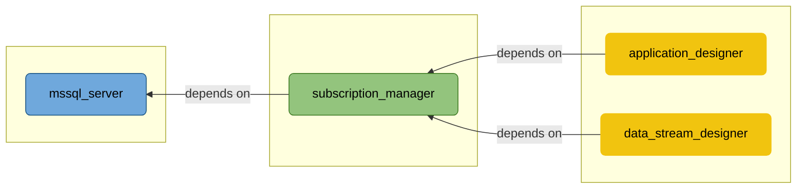
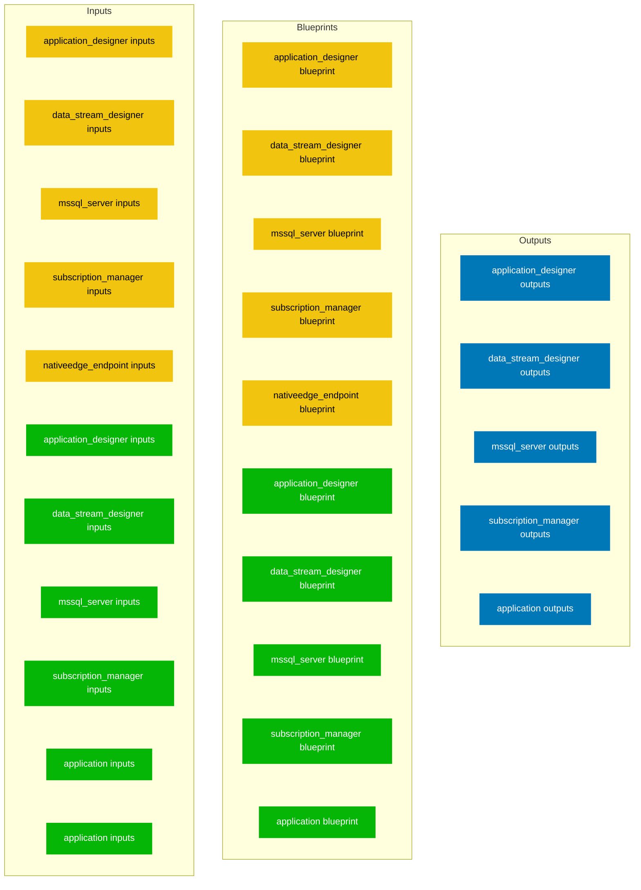

This document is auto-generated from the YAML file <SwmPath>[XMPro_Suite_for_NativeEdge_Endpoint.yaml](/XMPro_Suite_for_NativeEdge_Endpoint.yaml)</SwmPath>

The <SwmToken path="/XMPro_Suite_for_NativeEdge_Endpoint.yaml" pos="1:0:0" line-data="tosca_definitions_version: dell_1_0">`tosca_definitions_version`</SwmToken> is <SwmToken path="/XMPro_Suite_for_NativeEdge_Endpoint.yaml" pos="1:3:3" line-data="tosca_definitions_version: dell_1_0">`dell_1_0`</SwmToken>.

# 1 Solution Architecture

## 1.1 Overview

- Creates Windows Virtual Machines on NativeEdge Endpoint and installs XMPro Software.

## 1.2 Architecture Diagram

# 2 Blueprint Structure

# 2.1 Blueprint Diagram

## 2.2 Blueprint Directory Structure
### todo, no mapping

## 3.1 Sizing

| Component | Default | Minimum |
|---|---|---|
| `application_designer` | <SwmToken path="/infrastructure/xmpro_suite/nativeedge_endpoint/components/application_designer/inputs.yaml" pos="58:4:4" line-data="    default: 4">`4`</SwmToken> vCPU <SwmToken path="/infrastructure/xmpro_suite/nativeedge_endpoint/components/application_designer/inputs.yaml" pos="74:4:4" line-data="    default: 16GB">`16GB`</SwmToken> RAM **<SwmToken path="/infrastructure/xmpro_suite/nativeedge_endpoint/components/application_designer/inputs.yaml" pos="94:4:4" line-data="    default: 40GB">`40GB`</SwmToken> OS Disk** | <SwmToken path="/infrastructure/xmpro_suite/nativeedge_endpoint/components/application_designer/inputs.yaml" pos="60:6:6" line-data="    - greater_or_equal: 2">`2`</SwmToken> vCPU - **-** |
| `data_stream_designer` | <SwmToken path="/infrastructure/xmpro_suite/nativeedge_endpoint/components/data_stream_designer/inputs.yaml" pos="58:4:4" line-data="    default: 4">`4`</SwmToken> vCPU <SwmToken path="/infrastructure/xmpro_suite/nativeedge_endpoint/components/data_stream_designer/inputs.yaml" pos="74:4:4" line-data="    default: 16GB">`16GB`</SwmToken> RAM **<SwmToken path="/infrastructure/xmpro_suite/nativeedge_endpoint/components/data_stream_designer/inputs.yaml" pos="94:4:4" line-data="    default: 40GB">`40GB`</SwmToken> OS Disk** | <SwmToken path="/infrastructure/xmpro_suite/nativeedge_endpoint/components/data_stream_designer/inputs.yaml" pos="60:6:6" line-data="    - greater_or_equal: 2">`2`</SwmToken> vCPU - **-** |
| `mssql_server` | <SwmToken path="/infrastructure/xmpro_suite/nativeedge_endpoint/components/mssql_server/inputs.yaml" pos="58:4:4" line-data="    default: 4">`4`</SwmToken> vCPU <SwmToken path="/infrastructure/xmpro_suite/nativeedge_endpoint/components/mssql_server/inputs.yaml" pos="74:4:4" line-data="    default: 16GB">`16GB`</SwmToken> RAM **<SwmToken path="/infrastructure/xmpro_suite/nativeedge_endpoint/components/mssql_server/inputs.yaml" pos="94:4:4" line-data="    default: 40GB">`40GB`</SwmToken> OS Disk** | <SwmToken path="/infrastructure/xmpro_suite/nativeedge_endpoint/components/mssql_server/inputs.yaml" pos="60:6:6" line-data="    - greater_or_equal: 2">`2`</SwmToken> vCPU - **-** |
| `subscription_manager` | <SwmToken path="/infrastructure/xmpro_suite/nativeedge_endpoint/components/subscription_manager/inputs.yaml" pos="58:4:4" line-data="    default: 2">`2`</SwmToken> vCPU <SwmToken path="/infrastructure/xmpro_suite/nativeedge_endpoint/components/subscription_manager/inputs.yaml" pos="74:4:4" line-data="    default: 8GB">`8GB`</SwmToken> RAM **<SwmToken path="/infrastructure/xmpro_suite/nativeedge_endpoint/components/subscription_manager/inputs.yaml" pos="94:4:4" line-data="    default: 40GB">`40GB`</SwmToken> OS Disk** | <SwmToken path="/infrastructure/xmpro_suite/nativeedge_endpoint/components/subscription_manager/inputs.yaml" pos="60:6:6" line-data="    - greater_or_equal: 2">`2`</SwmToken> vCPU - **-** |

## 3.2 Operating System

operating 1 -
- <SwmToken path="/infrastructure/xmpro_suite/nativeedge_endpoint/components/application_designer/blueprint.yaml" pos="56:4:4" line-data="              get_input: ad_vm_user_name">`ad_vm_user_name`</SwmToken>

operating 2 -
- <SwmToken path="/infrastructure/xmpro_suite/nativeedge_endpoint/components/application_designer/blueprint.yaml" pos="74:4:4" line-data="              get_input: ad_disk">`ad_disk`</SwmToken>

operating 3 -
- <SwmToken path="/infrastructure/xmpro_suite/nativeedge_endpoint/blueprint.yaml" pos="12:4:4" line-data="            get_input: binary_image_artifact_url">`binary_image_artifact_url`</SwmToken>

operating 4 -
- <SwmToken path="/infrastructure/xmpro_suite/nativeedge_endpoint/inputs.yaml" pos="53:0:19" line-data="      Virtual Machine Image Version that will be used to create">`      Virtual Machine Image Version that will be used to create`</SwmToken>

Operating System -
- <SwmToken path="/infrastructure/xmpro_suite/nativeedge_endpoint/components/application_designer/blueprint.yaml" pos="46:4:4" line-data="          id: Windows_Virtual_Machine_for_NativeEdge_Endpoint">`Windows_Virtual_Machine_for_NativeEdge_Endpoint`</SwmToken>

- <SwmToken path="/infrastructure/xmpro_suite/nativeedge_endpoint/components/application_designer/blueprint.yaml" pos="64:5:5" line-data="              get_attribute: [binary_image, binary_details, extra, artifact_id]">`binary_image`</SwmToken>
- <SwmToken path="/infrastructure/xmpro_suite/nativeedge_endpoint/components/application_designer/blueprint.yaml" pos="64:8:8" line-data="              get_attribute: [binary_image, binary_details, extra, artifact_id]">`binary_details`</SwmToken>
- <SwmToken path="/infrastructure/xmpro_suite/nativeedge_endpoint/components/application_designer/blueprint.yaml" pos="64:11:11" line-data="              get_attribute: [binary_image, binary_details, extra, artifact_id]">`extra`</SwmToken>
- <SwmToken path="/infrastructure/xmpro_suite/nativeedge_endpoint/components/application_designer/blueprint.yaml" pos="64:14:14" line-data="              get_attribute: [binary_image, binary_details, extra, artifact_id]">`artifact_id`</SwmToken>

## 3.3 Artifacts and Binaries

- <SwmToken path="/infrastructure/xmpro_suite/nativeedge_endpoint/blueprint.yaml" pos="7:4:12" line-data="    type: dell.nodes.nativeedge.template.BinaryImage">`dell.nodes.nativeedge.template.BinaryImage`</SwmToken>

2. "missing path 'infrastructure/xmpro_suite/vsphere/components/data_stream_designer/blueprint.yaml' in primary yaml

- <SwmToken path="/application/mssql_server/inputs.yaml" pos="15:1:7" line-data="    XMIdentity.Database.Console.exe">`XMIdentity.Database.Console.exe`</SwmToken>

4. ====not supported yet====

## 3.4 Secrets

1. 
- <SwmToken path="/infrastructure/xmpro_suite/nativeedge_endpoint/components/application_designer/blueprint.yaml" pos="15:9:9" line-data="      get_secret: { get_input: ad_vm_password_secret_name }">`ad_vm_password_secret_name`</SwmToken>

- <SwmToken path="/application/application_designer/blueprint.yaml" pos="26:9:9" line-data="      get_secret: { get_input: ad_vm_password_secret_name }">`ad_vm_password_secret_name`</SwmToken>

2. 
- <SwmToken path="/infrastructure/xmpro_suite/nativeedge_endpoint/components/application_designer/inputs.yaml" pos="20:4:4" line-data="    type: secret_key">`secret_key`</SwmToken>

## 3.5 Plugins

- <SwmToken path="/infrastructure/xmpro_suite/nativeedge_endpoint/blueprint.yaml" pos="2:3:7" line-data="  - plugin:edge-plugin">`plugin:edge-plugin`</SwmToken>
- <SwmToken path="/application/blueprint.yaml" pos="2:3:17" line-data="  - plugin:ansible-plugin?version=>=4.0.0.0">`plugin:ansible-plugin?version=>=4.0.0.0`</SwmToken>
- <SwmToken path="/application/blueprint.yaml" pos="3:3:17" line-data="  - plugin:utilities-plugin?version=>=3.0.0.0">`plugin:utilities-plugin?version=>=3.0.0.0`</SwmToken>

# 4 Inputs

## 4.1.1. General Infrastructure Inputs

| Name | Display Label | Type | Default | Constraints | Description | Dependency |
|---|---|---|---|---|---|---|
| `hostname_prefix` | Hostname Prefix | string | XMPro | pattern: ^(?!-)[a-zA-Z0-9-]{1,63}(?<!-)$ | The hostname prefix to apply to all Virtual Machines. | - |
| `os_type` | OS Type | string | WIN2019-SERVER | WIN2019-SERVER or WIN2022-SERVER or WIN-OTHERS | The virtual machine Operating System. | - |
| `segment_name` | Bridged Network Name | string | - | extra.hw_core.network.virtualSegment[?type=='BRIDGE'].name get_inventory.get_environment_capability: extra.hw_core.network.virtualSegment | Name of the Bridged Network. | - |
| `dhcp` | DHCP | boolean | true | - | Enable to allow IP configuration to be taken from DHCP | - |
| `dns` | DNS Servers | list | [] | - | List of DNS servers addresses. | Will be shown only when dhcp flag is set to false |
| `gateway` | Gateway IP Address | string | - | pattern: ^((25[0-5]\|(2[0-4]\|1\d\|[1-9]\|)\d)\.?\b){4}$\|^$ | IP Address of the Network Gateway. | Will be shown only when dhcp flag is set to false |

## 4.1.2. MSSQL Infrastructure Inputs

| Name | Display Label | Type | Default | Constraints | Description | Dependency |
|---|---|---|---|---|---|---|
| `db_vm_user_name` | Microsoft SQL Server Deployment User | string | Administrator | pattern: ^(?!\s)(?!.*\s$).*$ | Name of the deployment user on the Virtual Machine. | - |
| `db_vm_password_secret_name` | Microsoft SQL Server Virtual Machine Password Secret Name | secret_key | - | type: password | Secret name containing the user password for | - |
| `db_vcpus` | Microsoft SQL Server vCPUs | integer | 4 | greater_or_equal: 2 | Number of virtual CPUs allocated to the Virtual Machine. | - |
| `db_memory_size` | Microsoft SQL Server Memory Size | string | 16GB | pattern: \d+(\.\d+)?(KB\|MB\|GB\|TB\|PB\|EB\|ZB\|YB) | Memory size with unit [KB,MB,GB,TB,PB,EB,ZB,YB]. | - |
| `db_os_disk_size` | Microsoft SQL Server OS Disk Size | string | 40GB | pattern: \d+(\.\d+)?(KB\|MB\|GB\|TB\|PB\|EB\|ZB\|YB) | Storage size with unit [KB,MB,GB,TB,PB,EB,ZB,YB]. | - |
| `db_disk` | Microsoft SQL Server Endpoint Datastore Path | string | - | - | Deployment datastore path on target endpoint. | - |
| `db_static_ip` | Microsoft SQL Server Static IP and Mask Suffix | string | - | pattern: ^(?:((25[0-5]\|2[0-4]\d\|1\d\d\|\d{1,2})(\.(25[0-5]\|2[0-4]\d\|1\d\d\|\d{1,2})){3})\/(3[0-2]\|[12]?\d)\|)$ | IP address and suffix. Example: 172.16.0.1/16. | Will be shown only when dhcp flag is set to false |
| `db_dns` | Microsoft SQL Server DNS Servers | list | [] | - | List of DNS servers addresses. | Will be shown only when dhcp flag is set to false |
| `db_gateway` | Microsoft SQL Server Gateway IP Address | string | - | - | IP Address of the Network Gateway. | Will be shown only when dhcp flag is set to false |

# 5 Install Workflow

### create

- implementation: <SwmToken path="/application/blueprint.yaml" pos="12:4:10" line-data="          implementation: application/scripts/validate_secrets.py">`application/scripts/validate_secrets.py`</SwmToken>
- executor: <SwmToken path="/application/blueprint.yaml" pos="13:4:4" line-data="          executor: central_deployment_agent">`central_deployment_agent`</SwmToken>

- base_url_secret_name → <SwmToken path="/application/blueprint.yaml" pos="16:4:4" line-data="              get_input: artifact_configuration_secret_name">`artifact_configuration_secret_name`</SwmToken>
- json_url_key → <SwmToken path="/application/blueprint.yaml" pos="17:4:4" line-data="            json_url_key: artifact_base_url">`artifact_base_url`</SwmToken>
- company_admin_password_secret_name → <SwmToken path="/application/blueprint.yaml" pos="19:4:4" line-data="              get_input: company_admin_password_secret_name">`company_admin_password_secret_name`</SwmToken>
- site_admin_password_secret_name → <SwmToken path="/application/blueprint.yaml" pos="21:4:4" line-data="              get_input: site_admin_password_secret_name">`site_admin_password_secret_name`</SwmToken>

### start

- implementation: <SwmToken path="/application/blueprint.yaml" pos="23:4:10" line-data="          implementation: application/scripts/validate_smtp.py">`application/scripts/validate_smtp.py`</SwmToken>
- executor: <SwmToken path="/application/blueprint.yaml" pos="24:4:4" line-data="          executor: central_deployment_agent">`central_deployment_agent`</SwmToken>

- smtp_enable → <SwmToken path="/application/blueprint.yaml" pos="27:4:4" line-data="              get_input: smtp_enable">`smtp_enable`</SwmToken>
- smtp_password_secret_name → <SwmToken path="/application/blueprint.yaml" pos="29:4:4" line-data="              get_input: smtp_password_secret_name">`smtp_password_secret_name`</SwmToken>

# 6 Unstall Workflow
### todo, no mapping

# Deployment Capabilities and Outputs
### todo, no mapping

# Interaction Diagram for Native Edge Endpoint Installation
### todo, unclear mapping

- <SwmToken path="/infrastructure/xmpro_suite/nativeedge_endpoint/components/application_designer/blueprint.yaml" pos="51:4:7" line-data="              - &quot;AD-vm-&quot;">`AD-vm-`</SwmToken>

# Monitoring and Debugging
### todo, no mapping

<SwmMeta version="3.0.0" repo-id="Z2l0aHViJTNBJTNBZGVsbC10b3kxJTNBJTNBb3Jlbnctc3dpbW0=" repo-name=" XMPro">Powered by [Swimm](https://app.swimm.io/)</SwmMeta>
