# Architecture diagram

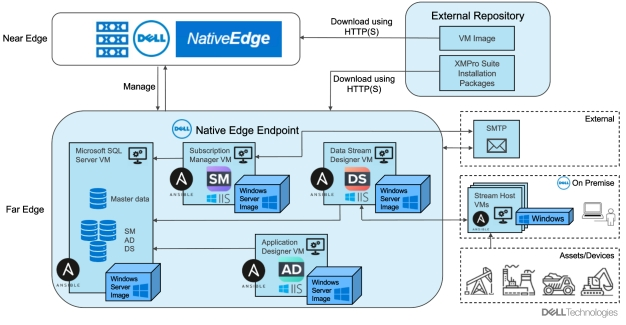

# Install Workflow
## Install Workflow Execution Steps
1. Follow the Prerequisites section:
    1. prepare the OS Image binary and Artifacts,
    2. upload the OS Image binary and Artifacts to the external repository,
    3. create the required secrets,
    4. make sure the required plugins are available,
    5. make sure a Native Edge Endpoint device is onboarded and ready.
2. Select your uploaded XMPro_Platform_Suite_for_NativeEdge_Endpoint_1.0.0 blueprint and click the Create Deployment button.
3. Provide correct values for all inputs and go to the next tab.
4. In the Types tab, select the desired Native Edge Endpoint environment deployment.
5. Review the inputs and start the deployment installation.
6. You can check the progress and see the deployment's capabilities on the main page of the deployment.
7. Deployment should be available in the Deployments -> Solutions -> <NED_environment_deployment> -> Subservices

# Uninstall Workflow
## Uninstall Workflow Execution Steps
1. Select your XMPro Platform Suite deployment in the Deployments -> Solutions -> <NED_environment_deployment> -> Subservices.
2. Run the uninstallation workflow.
(Optional) After the uninstall is finished, delete the deployment.

# Prerequisites

## Operating System
Windows Server 2019 or 2022 OS Image must be created and uploaded to an external repo.
Image can be created based on the instruction: [NATIVE EDGE Windows Server 2019 base ISO image - Dell Cloudify](https://confluence.cec.lab.emc.com/display/DCFY/NATIVE+EDGE+Windows+Server+2019+base+ISO+image)

Additional notes:

- The OS Image must support Windows Features and Windows Optional Features for Windows IIS to be installed offline - without the Internet connection.
  It should be available for the official Windows Server 2019 and 2022 images but needs to be verified.
- Microsoft Edge browser does not need to be installed in the OS Image but it may slightly speed up the blueprint installation process.
  Blueprint verifies if the MS Edge is already installed - if not, it installs it using the official package from the Microsoft Website or from an external repository.

## NativeEdge Endpoint
NativeEdge Endpoint must onboarded to the EO and available for the blueprints.

# Interaction diagrams

# Monitoring and Debugging

During the install/uninstall workflow execution, progress can be observed on the Deployments -> Solutions page.​

Open XMPro Suite Deployment:

1. Select the Endpoint deployment, where XMPro Suite Deployment is installed, and click the Subservices​
2. You should see the progress bar under the Status label​
3. If you want more logs, click on the XMPro Suite Deployment name and scroll down to Event/Logs

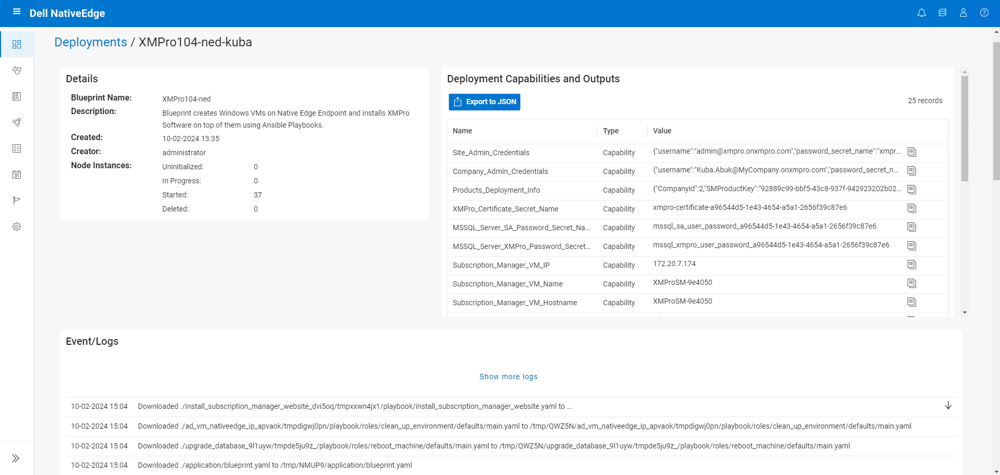

Open XMPro Suite Component Virtual Machine Deployment:

1. Select the Endpoint deployment, where XMPro Suite Deployment is installed, and click the Subservices​
2. Select the XMPro Suite Deployment and click the Subservices
3. You should see the deployments for each XMPro Component Virtual Machine: MSSQL, Subscription Manager, Application Designer, and Data Stream Designer.
4. If you want more logs, click on the desired Virtual Machine deployment name and scroll down to Event/Logs
​

To debug an installed deployment, login to one of the Virtual Machines and check if the Websites are reachable.
Additionally, you can verify the configuration of particular components:

1. MS SQL Server Virtual Machine
    - check if the SQL Server process is running,
    - check if the SQL Server is accessible using the sqlcmd tool,
    - check if the SA and XMPro users can log in to the server (their passwords are available in the secrets from the Deployment's Outputs),
    - check if the components' databases are created: SM, AD, DS.
2. Subscription Manager Virtual Machine
    - check if the Signing Certificate and XMPro Website Certificate are installed in the Personal and Trusted Root Certification Authorities stores,
    - check if the Subscription Manager Website uses the XMPro Website Certificate (with Virtual Machines Hostnames in DNS Server details), and if it is trusted,
    - check the <xmpro> section configuration in the C:\inetpub\wwwroot\Web.config,
    - check if the ASP .NET Hosting Bundle 6.0.25 is installed,
    - check if the Rewrite AMD64 Module is installed.
3. Application Designer Virtual Machine
    - check if the Signing Certificate and XMPro Website Certificate are installed in the Personal and Trusted Root Certification Authorities stores,
    - check if the Application Designer Website uses the XMPro Website Certificate (with Virtual Machines Hostnames in DNS Server details), and if it is trusted,
    - check the System Environment Variables for the Application Designer Website,
    - check if the ASP .NET Hosting Bundle 6.0.25 is installed,
    - check if the Rewrite AMD64 Module is installed.
4. Data Stream Designer Virtual Machine
    - check if the Signing Certificate and XMPro Website Certificate are installed in the Personal and Trusted Root Certification Authorities stores,
    - check if the Data Stream Designer Website uses the XMPro Website Certificate (with Virtual Machines Hostnames in DNS Server details), and if it is trusted,
    - check the System Environment Variables for the Data Stream Designer Website,
    - check if the ASP .NET Hosting Bundle 6.0.25 is installed,
    - check if the Rewrite AMD64 Module is installed.

# Accessing Solution

## Open XMPro Website

After a successful deployment of the XMPro Platform Suite, you can access the websites of each XMPro Component installed.
To do so, you need to access one of the XMPro Virtual Machines created with the installation. Most preferably the Subscription Manager Virtual Machine, but all Applications Websites should be accessible from each XMPro Virtual Machine.

To access the Windows Virtual Machine:

1. Open the Console from EO
    - On the EO, open the Endpoints tab and expand the Native Edge Endpoint with XMPro Virtual Machines installed,
    - Select the XMProSM Virtual Machine,
    - Select More Actions → Console.

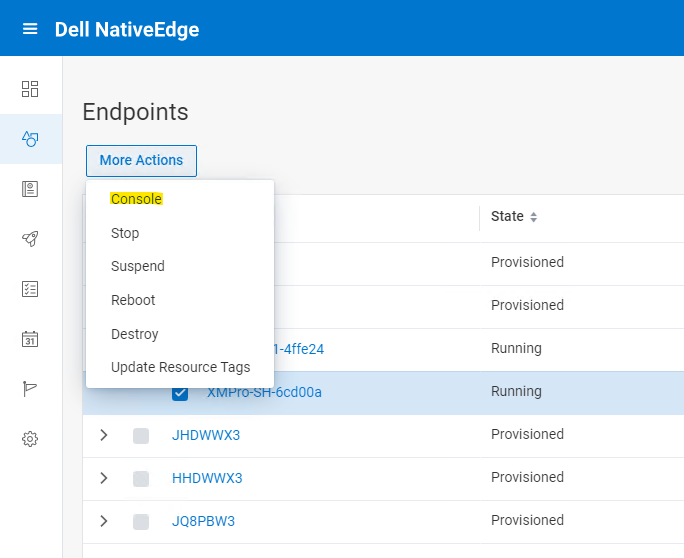

2. Open a Remote Desktop session to the Virtual Machine
    - (Note: It is possible that the Remote Desktop connection must be allowed beforehand in the Server Manager on the Subscription Manager Virtual Machine)
    - Get the Subscription Manager Virtual Machine IP and login credentials from the XMPro Platform Suite Deployment Outputs,
    - Open the Remote Desktop Connection from your machine,
    - Enter the Subscription Manager Virtual Machine IP and the credentials, and open the session.

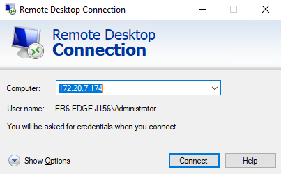

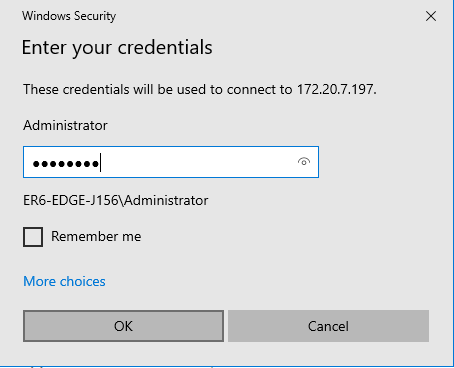

After accessing the Virtual Machine, the Microsoft Edge Browser should be opened with the XMPro Subscription Manager page.
If not, open a new Microsoft Edge Window and restore previously closed tabs. It should bring back the Subscription Manager page.
If there is no possibility to restore the closed page, enter the XMPro Subscription Manager URL taken from the XMPro_Website_Endpoint Output of the XMPro Platform Suite Deployment.

You should be able to see the Login Page of XMPro Platform.

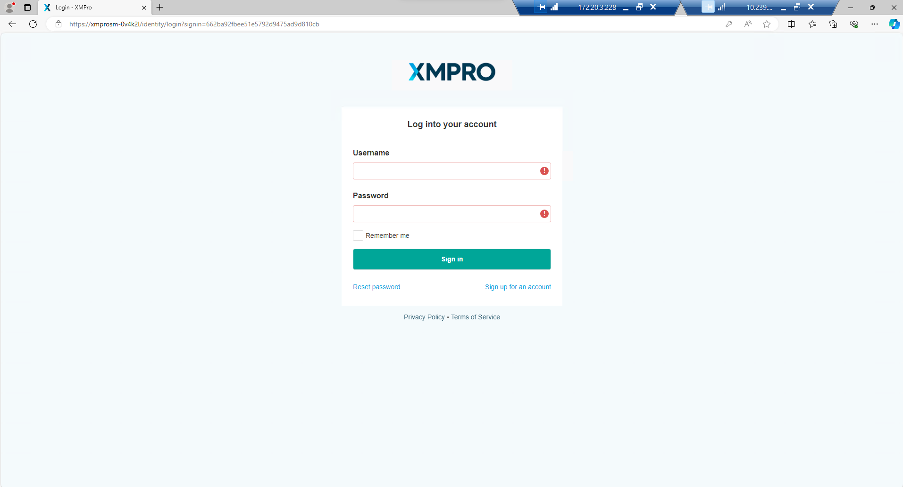

Take the credentials of the Company Admin (recommended) or Site Admin from the outputs of the XMPro Platform Suite Deployment and log in.

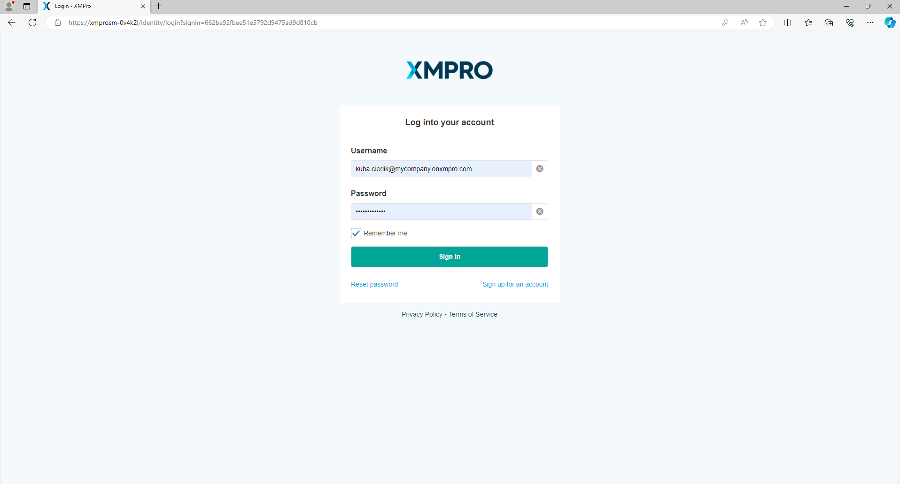

You should be able to see the Dashboard of the Subscription Manager:

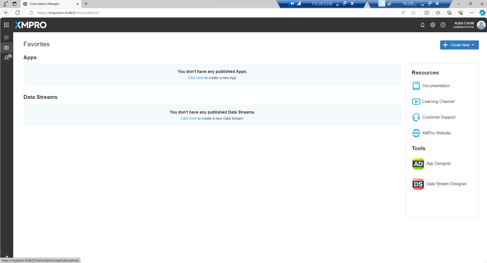

## XMPro Licensing

XMPro Platform licensing is a manual process described in the XMPro Documentation: [Request and Apply a License - XMPro](https://documentation.xmpro.com/administration/subscriptions-admin/request-and-apply-a-license)

Follow the steps on the Subscription Manager Dashboard for both Application Designer and Data Stream Designer.
Request and then apply both licenses.

After the licenses are applied, log out from all XMPro websites, refresh the page, and log in once again.
Now, both products are licensed and ready to create Applications and Data Streams.

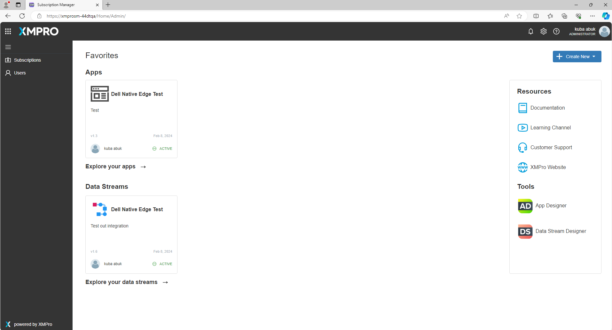

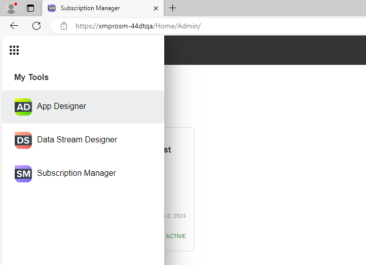

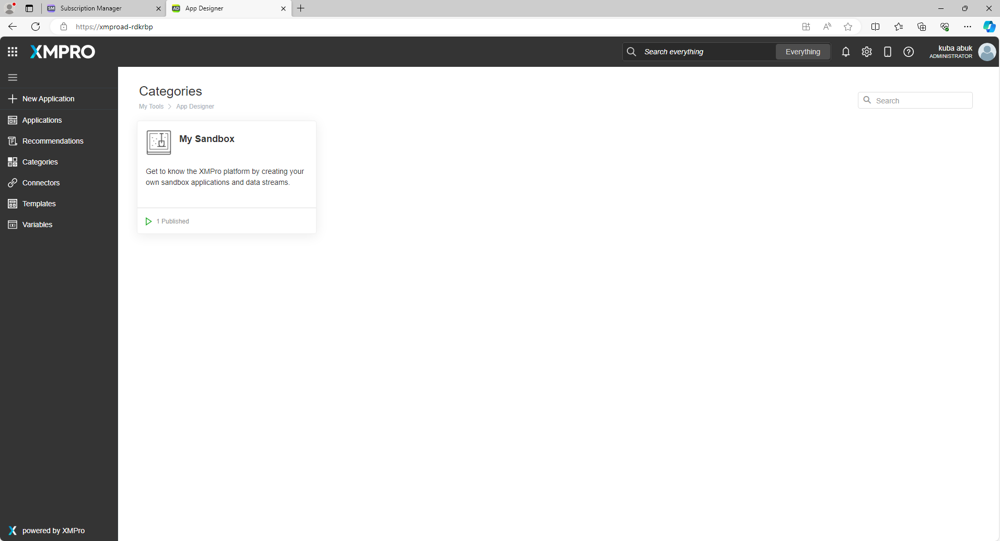

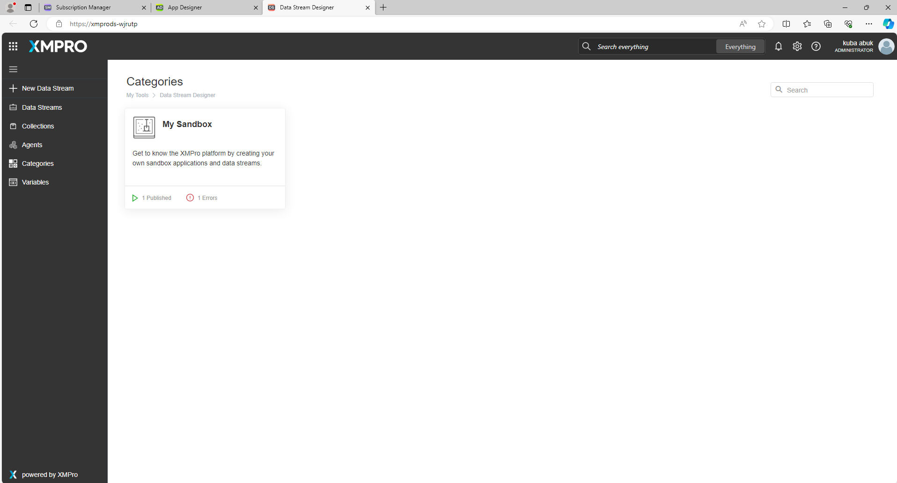
